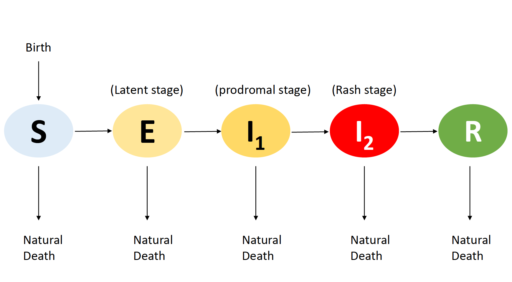

------

------

# 1. Introduction

Smallpox, one of the most devastating infectious diseases, was caused by the variola virus. The history of smallpox can be traced back to 3rd century BCE in Egypt and the last incidence due to natural breakout was in 1977 in the world and 1949 in the US[1-2]. Even though smallpox has been eradicated both due to efforts of WHO and inventions of the vaccine, public health researchers are still concerned about the bioterrorism using smallpox virus [3].

{width=30%}

In this case study, we want to utilize weekly cases of smallpox in California from 1928-1935 to understand the transmission dynamics of smallpox. Furthermore, by fitting the partially observed Markov process model (POMP) on this dataset, we would love to understand some key parameters of the POMP model through simulation.

------

------
# 2. Smallpox Cases and California population Data 

We obtained the weekly cases of smallpox in California from Project Tycho (https://www.tycho.pitt.edu/data/). We also acquired the population in California from 1840-2000 from US Census Bureau (https://www.census.gov/history/pdf/california_res_pop-jan2018.pdf). However, because the only population on decades apart was provided, estimation on weekly population data was calculated through fitting a smoothing spline (detailed in section 2.2).

## 2.1 Smallpox Cases

Below is a plot of the Smallpox weekly cases from 1928-01-01 to 1935-9-14. We delete one data point at 1930-5-25 since the 9 cases seem to due to measurement or reporting error (the previous week has 145 cases, and the next week has 96).

We can see that there are four major bumps in the first four years (1928,1929,1930,1931) followed by consistent decreasing in the cases. If the population is closed, there is unlikely to have several bumps after the initial outbreak. Therefore, we believe that there are some imported infections from out of state. 

As for the selection of data, it is mentionable that there are some new bumps at the end of 1936, which we did not include here. The main reason we selected these 400 points is for sake of simplicity and develop a simple and easy-to-understand model that fits the data well.


```{r, echo=F,warning=F,fig.cap="Figure 1. Smallpox Incidence",fig.align='center'}
#setwd("/Users/miaow/Downloads")
rm(list=ls())
dt = read.csv("tycho_20180409-204512.csv")

### Preprocess Data 

# select subdata
dt_sub = dt[c(6:130,132:407),]
# delete 1930-5-25 (data error: 145-8-96)
#dt_sub$PeriodStartDate[1]
#dt_sub$PeriodEndDate[nrow(dt_sub)]

# weekly data 1928-1-1 to 1935-9-14
par(mfrow=c(1,1))
smallpox.ts = ts(data = dt_sub$CountValue,
                  start=1928, frequency = 52)
plot(smallpox.ts,ylab = "New cases of smallpox",
     main = "Weekly data on smallpox incidence from 1928-1935")
summary(smallpox.ts)
```


## 2.2 Population, Birth, Death

### 2.2.1 Estimated weekely population 

We were only able to find population data for decades apart from 1840 up to 2000 (Figure 2 Left). Therefore, we fitted a smoothing spline to the data points and estimate the weekly population size in California(Figure 2 Right). 

From Figure2, it seems that the population approximately follows an exponential growth.

- The red dashed line: $pop(t) = A*exp(\lambda*t)$, where $A,\lambda$ were estimated by OLS estimation on $log(pop)$ with covariate $t$.
- Therefore, it is natural to assume the growth rate is constant over 1928-1935. 


```{r,echo=F,fig.width=15,fig.height=6,fig.cap="Figure 2. Population Statistics and Estimation",fig.align='center'}
# population estimated from historical curve
# https://www.census.gov/history/pdf/california_res_pop-jan2018.pdf
# migration before 1940 is negigible
par(mfrow=c(1,2))
temp = c(92597,379994,560247,864694,1213398,1485053,2377549,3426861,
         5677251,6907387,10586223,15717204,19971069,23667764,29760021,33871648)
time_temp = 1840+cumsum(rep(10,16))
time_dt = 1927+47/52+(1:nrow(dt_sub))/52

# exponential curve
m = (lm(log(temp)~time_temp))$coef


plot(time_temp,temp,ylab="population",xlab = "Year",main="Population in California with estimated exponential curve from 1850-2000",pch=19)
lines(time_temp,exp(m[1])*exp(time_temp*m[2]),col="red",lty=2)
covar = as.data.frame(list(time = time_dt,
                           pop=predict(smooth.spline(x=time_temp,y=temp),x=time_dt)$y))

pop.ts = ts(data = covar$pop,
            start=1928, frequency = 52)
plot(pop.ts,ylab = "Estimated population in California",
     main = "Estimated weekly population from 1928-1935")

### Preparation 
dat = as.data.frame(list(cases = dt_sub$CountValue,
                         time = 1927+47/52+(1:nrow(dt_sub))/52))
rm(dt,dt_sub,pop.ts,smallpox.ts,temp,time_temp,time_dt)
```


### 2.2.2 Birth and natural death rate 

The growth rate is a net effect of natural death rate and birth rate (ignoring deaths due to smallpox since cases <<< population).

In this study, we decided to prefix the birth and death rate rather than estimating them through the data. This is because it is hard to estimate population-related parameter through these smallpox data (some preliminary trail shows that the two rates have co-identifiability issue). Therefore, for the sake of stability of the model estimation, we will assume they have known constants.  

- The death rate $=1/75=0.01333$ (assuming an average lifesapn of 75 years)
- The birth rate $=0.029$

**Why?**

*From the population data, the net gwoth rate is about $1.15%$, notice that the difference between birthrate and death rate is about $0.15%$.*


------

------

# 3. Design of POMP Model for Smallpox
## 3.1 Smallpox flow diagram

The natural history of smallpox is usually divided into three stages[3]: 

- __latent__ (when the individual is incubating the infection and is not infectious)
- __prodromal__ (when the individual has some feverish symptoms, and somewhat infectious)
- __rash__ (when the individual developed the classic smallpox rashes and is mostly infectious) 

Based on this natural history of smallpox, we will used a $S-E-I_1-I_2-R$ Model (looks like below). 

{width=80%}


Here, we suppose there is five distinct stage: 

- $S$ (susceptible to smallpox, who did not vaccination or never have smallpox before)
- $E$ (exposed to smallpox, but not infectious yet)
- $I_1$ (prodromal stage, showing feverish symptoms and infectious)
- $I_2$ (rash stage, showing classical rash symptoms and infectious)
- $R$ (recovered from smallpox or died from smallpox)

The transmission rate from each stage will be defined in the next section. 

## 3.2 ODE representation

The ordinary differnetial equation interpretation of the $S-E-I_1-I_2-R$ Model looks like the follows: 
$$\frac{dS}{dt}=br - dr - \mu_{SE}(t)$$
$$\frac{dE}{dt}=\mu_{SE}-dr-\sigma_{EI1}$$
$$\frac{dI_1}{dt}=\sigma_{EI1}-dr-\sigma_{I1I2}$$
$$\frac{dI_2}{dt}=\sigma_{I1I2}-dr-\sigma_{I2R}$$
Where $br$, $dr$ are the prefixed birth rate and death rate and $\sigma_{EI1},\sigma_{I1I2},\sigma_{I2R}$ are the parameters of rate flowing from the previous state to the next. 

Based on the compartment model and the ODEs, we want to develop a process model by incorporate some randomness: 

a. For short time $\Delta t$, the number of births follows Possion distribution with birth rate = 0.029

b. Instead of setting $\mu_{SE}(t)$ as a fixed parameter, we will make the transmission process from S to E both depending on time,number of infections, population size as well as incorporating some random stochasticness (details in next section). 


## 3.3 Defineing transmission process from S to E

Transmission process is a critial part in any SIR model in order to accurately reflect assumptions and understanding of the diseases. Here, we borrowed similar idea from the measles study [4-5] and the last year mump project [6] to construct the transmission process:

$$\mu_{SE}(t) = \frac{\beta(t)}{N(t)}(I_1+\lambda I_2+\iota)\xi(t)$$ 

where $$\beta(t) = R_0 (1+A*cos(2\pi t+Phase))$$ and 
$$\xi(t) \sim WN$$ 

______
Think of the transmission process composed by two part: 

1. **A deterministic part**: 

$$\frac{\beta(t)}{N(t)}(I_1+\lambda I_2 + \iota)$$

a. This part also has a 'famous' name *force of infection*, which simpliy means the rate of some susceptible inidividual acquire an infectious diseases (the inverse will be the avergae time spent of being susceptible before becoming exposed).

b. Here we give the transmission rate $\beta(t)$ following a sinusodial trend to account for an annual seasonality (notice: we set up this way so that $0<A<1, R_0 >0$ will enforce $\beta(t)>0$).

c. Since, individuals in $I_2$(rash stage) are mostly likely to be diagnosed and quanrentined, we believe their contribution to force of infection is downweighted by $\lambda$ ($0<\lambda<1$). 

d. As, we saw that there were four bumps in the data, imported infection $\iota$ is also introduced. 


2. **A stochastic part**: 

$\xi(t)$ follows Gamma White noise with intensity $\sigma_{SE}$

*We add some noise to the process model so that the model will have better fit on the data (also in order to be able to use POMP).*

_______


## 3.4 Measurment Model 

Becuase people at the prodromal stage with feverish symptoms are not likely to be reported and they will all eventually go to the rash stage, we only consider people going from rash stage to recovered (removed) stage as true incidence. Here, in contrast to Mump and measles case study[4-6], we assume there is no under-reporting and only consider a measurement error ($\psi$). Because smallpox is well-known and has an acute reaction, the reporting rate will likely to be close to 1 (estimation parameter at boundary value might be difficult).

Let us denote the new cases at time $t$ as $case_t$. $C$ is the true incidence. (similar to [4-6])

Therefore, 
$$E(case_t|C) = C$$
$$Var(case_t|C) = \psi^2C^2$$

Therefore, $$f(case_t|C,\psi) =  \Phi(cases_t+0.5,C,\psi^2C^2)-\Phi(cases_t-0.5,C,\psi^2C^2)$$
where $\Phi(x,\mu,\sigma^2)$ is the c.d.f of normal distirbution with mean $\mu$ and varience $sigma^2$. 

## 3.5 Summary of POMP

- Covarite: population size: $N(t)$
- Force of infection: 

$$\mu_{SE}(t) = \frac{\beta(t)}{N(t)}(I_1+\lambda I_2+\iota)\xi(t)$$ 

where $$\beta(t) = R_0 (1+A*cos(2\pi t+Phase))$$ and 
$$\xi(t) \sim WN (Gamma,\sigma_{SE})$$ 

- Mesurment error:
$$f(case_t|C,\psi) =  \Phi(cases_t+0.5,C,\psi^2C^2)-\Phi(cases_t-0.5,C,\psi^2C^2)$$

# 4. Implmentation of POMP Model in R

## 4.1 Constructing pomp object 

```{r, include=F}
set.seed(594709947L)
require(ggplot2)
theme_set(theme_bw())
require(plyr)
require(dplyr)
require(reshape2)
require(foreach)
require(doMC)
require(doParallel)
require(pomp)
require(gridExtra)
stopifnot(packageVersion("pomp")>="0.69-1")

```

```{r, echo=T,warning=F}
# Process Model 
rproc <- Csnippet("
                  double Beta,foi, dw, births;
                  double rate[8], trans[8];
                  
                  // seasnolaity 
                  Beta = R0*(1+A*cos(M_2PI*t+Phase));
                  // expected force of infection
                  foi = Beta*(I1+Lambda*I2+iota)/pop;
                  // white noise (extrademographic stochasticity)
                  dw = rgammawn(sigmaSE,dt);
                  
                  rate[0] = foi*dw/dt;        // stochastic force of infection
                  rate[1] = 0.01333;             // natural S death
                  rate[2] = sigma_EI1;        // rate of ending of latent stage
                  rate[3] = 0.01333;             // natural E death
                  rate[4] = sigma_I1I2;        // rate of ending I1 stage
                  rate[5] = 0.01333;             // natural I1 death
                  rate[6] = sigma_I2R;         // rate of ending I2 stage
                  rate[7] = 0.01333;             // natural I2 death
                  
                  // Poisson births, birth rate
                  births = rpois(0.029*dt);
                  
                  // transitions between classes
                  reulermultinom(2,S,&rate[0],dt,&trans[0]);
                  reulermultinom(2,E,&rate[2],dt,&trans[2]);
                  reulermultinom(2,I1,&rate[4],dt,&trans[4]);
                  reulermultinom(2,I2,&rate[6],dt,&trans[6]);
                  
                  
                  S += births - trans[0] - trans[1];
                  E += trans[0] - trans[2] - trans[3];
                  I1 += trans[2] - trans[4] - trans[5];
                  I2 += trans[4] - trans[6] - trans[7];
                  R = pop - S - E - I1 - I2;
                  W += (dw - dt)/sigmaSE;  // standardized i.i.d. white noise
                  C += trans[4];           // true incidence
                  ")

# Initalize 
initlz <- Csnippet("
                   double tol = 1.0;
                   double m = pop/(S_0+E_0+I1_0+I2_0+R_0+tol);
                   S = nearbyint(m*S_0);
                   E = nearbyint(m*E_0);
                   I1 = nearbyint(m*I1_0);
                   I2 = nearbyint(m*I2_0);
                   R = nearbyint(m*R_0);
                   W = 0;
                   C = 0;
                   ")


# Measurment Error Model 
# set rho = 1
dmeas <- Csnippet("
                  double m = C;
                  double v = m*(psi*psi*m);
                  double tol = 1.0e-18;
                  if (cases > 0.0) {
                  lik = pnorm(cases+0.5,m,sqrt(v)+tol,1,0)-pnorm(cases-0.5,m,sqrt(v)+tol,1,0)+tol;
                  } else {
                  lik = pnorm(cases+0.5,m,sqrt(v)+tol,1,0)+tol;
                  }
                  ")

rmeas <- Csnippet("
                  double m = C;
                  double v = m*(psi*psi*m);
                  double tol = 1.0e-18;
                  cases = rnorm(m,sqrt(v)+tol);
                  if (cases > 0.0) {
                  cases = nearbyint(cases);
                  } else {
                  cases = 0.0;
                  }
                  ")

# parameter transmformation 
smallpox_toEstimationScale <- Csnippet(" 
                                       TR0 = log(R0);
                                       TA = logit(A);
                                       Tiota = log(iota);
                                       Tsigma_EI1 = log(sigma_EI1);
                                       Tsigma_I1I2 = log(sigma_I1I2);
                                       Tsigma_I2R = log(sigma_I2R);
                                       TLambda = logit(Lambda);
                                       TsigmaSE = log(sigmaSE);
                                       Tpsi = log(psi);
                                       to_log_barycentric (&TS_0, &S_0, 5);
                                       ")

smallpox_fromEstimationScale <- Csnippet("
                                         TR0 = exp(R0);
                                         TA = expit(A);
                                         Tiota = exp(iota);
                                         Tsigma_EI1 = exp(sigma_EI1);
                                         Tsigma_I1I2 = exp(sigma_I1I2);
                                         Tsigma_I2R = exp(sigma_I2R);
                                         TLambda = expit(Lambda);
                                         TsigmaSE = exp(sigmaSE);
                                         Tpsi = exp(psi);
                                         from_log_barycentric (&TS_0, &S_0, 5);
                                         ")

# constructing POMP model 
dat %>% 
  pomp(t0=with(dat,2*time[1]-time[2]),
       time="time",
       
       rprocess=euler.sim(rproc,delta.t=1/365.25),
       initializer=initlz,
       dmeasure=dmeas,
       rmeasure=rmeas,
       
       fromEstimationScale = smallpox_fromEstimationScale,
       toEstimationScale = smallpox_toEstimationScale,
       
       covar=covar,
       tcovar="time",
       
       zeronames=c("C","W"),
       statenames=c("S","E","I1","I2","R","C","W"),
       paramnames=c("R0","A","Phase","iota",
                    "sigma_EI1","sigma_I1I2","sigma_I2R",
                    "Lambda","sigmaSE","psi",
                    "S_0","E_0","I1_0","I2_0","R_0")) -> m1
```


## 4.2 Local maximization 

We will utilize the iterated filtering alogorthm (IF2) developed by Ionides et al (2015) [7], which carries out particle filter with the parameter vector performing a random walk. This is naturally implemented in the `pomp` package. 

### 4.2.1 Starting value 

Whenever we perform a local maximum likelihood search, we need some initial value for each parameter. We try some different combinations until they generated a reasonably simulated graph compared to the actual data. Specifically, we want 

a. the area of each several simulations at least cover the space of the actual data. 
b. starting values will produce some reasonable likelihood (se < 1, in the best case).

Below is our starting value for local maximum.
```{r, echo=T}
## ---start parameter----------------------
 start_params = c(R0=4.0,A=0.5,Phase=2,iota=3,
                  sigma_EI1 = 2,sigma_I1I2=10,sigma_I2R=5,
                  Lambda=0.3,sigmaSE=0.5,
                  psi=0.7,
                  S_0=5.2e6,E_0 = 5000,I1_0=50,I2_0=150,R_0=5e5)
```


The corresponding simulated graph is as follows:
```{r, echo=T, fig.cap="Figure 3. Simulated data (blue) vs actual data (black)",warning=F,fig.align="center"}
## --- Plot ----
simulate(m1,params=start_params,nsim=50,states=T) -> x
matplot(time(m1),t(x["C",1:50,]),type="l",lty=1,xlab="time",ylab="Cases",bty="l",col='blue')
lines(time(m1),obs(m1,"cases"),lwd=2,col="black")
```


The corresponding 10 simulated liklihood (through `pfilter`, 5000 particles)  is as follows:
```{r,echo=T, cache=T,warning=F}
## --- Try to see Liklihood of starting value ---
pf = replicate(10,pfilter(m1,Np=5000,params=start_params))
l1 = sapply(pf,logLik)
l1
logmeanexp(l1,se=T)
```

### 4.2.2 Run level set up

We used the same run level 3 for both local and global MLE as below. Ideadly, we would love to increase the particle number to (2e4-5e4) and number of global evluation to 100. However, becuase of the limited resource on Flux, we set up to have 10,000 particles, 300 IMF iterations and 20 global/local evaluations. 

*notice: we first run on our own computer for run level 1, and calculate the approxmated time needed for run level 3 (assuming linear increase in time) so that we will set the minimum wall-time and cores needed on Flux to save resource.*


```{r, echo=T,warning=F}
## --- Run level ------------------------
run_level <- 3 #
switch(run_level,
       {smallpox_Np=100; smallpox_Nmif=100; smallpox_Neval=10; smallpox_Nglobal=10; smallpox_Nlocal=10}, 
       {smallpox_Np=5000; smallpox_Nmif=200; smallpox_Neval=10; smallpox_Nglobal=20; smallpox_Nlocal=20}, 
       {smallpox_Np=10000; smallpox_Nmif=300; smallpox_Neval=10; smallpox_Nglobal=20; smallpox_Nlocal=20}
)
cores <- 6  # The number of cores on this machine (15 used)
registerDoParallel(cores)
mcopts <- list(set.seed=TRUE)

set.seed(396658101,kind="L'Ecuyer")
```

### 4.2.3 Local MLE

Before global MLE Search & Eval, we need to provide an interval for each parameter. Such interval needs to contain the optimal parameter value (MLE) but not too wide at the same time. Therefore, we will carry out a local search with the starting value defined in section 4.2. The purpose of the local search is for a better and more efficient global search. 

```{r,echo=F,warning=F,fig.cap="Figure4.Pairplot of paramaters in local search",fig.height=20,fig.width=20,fig.align="center"}
## ----lik_local search-----------------------------------------------------
 stew(file=sprintf("local-search-%d.rda",run_level),{

   t_local <- system.time({
     mifs_local <- foreach(i=1:smallpox_Nlocal,
                           .packages='pomp',
                           .combine=c,
                           .options.multicore=mcopts) %dopar%
       mif2(
        m1,
         start=start_params,
         Np=smallpox_Np,
         Nmif=smallpox_Nmif,
         cooling.type="geometric",
         cooling.fraction.50=0.5,
         transform=TRUE,
         rw.sd=rw.sd(
           R0=0.02,A=0.02,Phase=0.02,iota=0.02,
           sigma_EI1=0.02,sigma_I1I2=0.02,sigma_I2R=0.02,
           Lambda=0.02,sigmaSE=0.02,
           psi=0.02,
           S_0=ivp(0.02),
           E_0=ivp(0.02),
           I1_0=ivp(0.02),
           I2_0=ivp(0.02),
           R_0=ivp(0.02))
       )
   })
 },seed=1270401374,kind="L'Ecuyer")

 ## ----lik_local eval-----------------------------------------------------
 stew(file=sprintf("lik_local_eval-%d.rda",run_level),{
   t_local_eval <- system.time({
     liks_local <- foreach(i=1:smallpox_Nlocal,
                           .packages='pomp',
                           .combine=rbind,
                           .options.multicore=mcopts) %dopar% {
                             evals <- replicate(smallpox_Neval, logLik(pfilter(m1,params=coef(mifs_local[[i]]),Np=smallpox_Np)))
                             logmeanexp(evals, se=TRUE)
                           }
   })
 },seed=442141592,kind="L'Ecuyer")

##--- local search/evla time -----------
# cores = 6
# level = 1: 429.590, 40.280
# level = 2: 17183.6 (5hr), 1611.2 (0.5hr)
# level = 3: 51550.8 (14hr), 4833.6 (2hr)
# cores = 15: 10 hr for level 3, 2 hr for level 2
## --------------------------------------

```

Here is part of the parameter's pairplot (we used them to determine a reasonable maximization interval for global search). 
```{r,echo=T,fig.cap="Figure 4. Local MLE pairplot of some selected parameters",fig.align="center",fig.width=6,fig.height=6}
results_local <- data.frame(logLik=liks_local[,1],logLik_se=liks_local[,2],t(sapply(mifs_local,coef)))
pairs(~logLik+R0+Phase+iota+Lambda,data=subset(results_local,logLik>max(logLik)-6))
```


## 4.3 Global maximization 


### 4.3.1 Codes 

Based on section 4.2.3, we select the range of each paramter as bellow, the starting value for global is chosen at the center of the interval. 

```{r,echo=T}
## ---- Determine the box for global search -------
smallpox_box =
  rbind(R0=c(5,15),
        A = c(0.99,0.9999),
        Phase = c(0.15,0.3),
        iota = c(3,15),
        sigma_EI1=c(10,13),
        sigma_I1I2=c(9,70),
        sigma_I2R=c(3.5,6),
        Lambda = c(0.2,0.999),
        sigmaSE = c(0.1,0.28),
        psi=c(0.2,0.25),
        S_0 = c(0.92,0.94),
        E_0 = c(0.0003,0.0005),
        I1_0 = c(5e-6,7e-6),
        I2_0 = c(1e-5,2e-5),
        R_0 = c(0.05,0.08)) # determined by local pariplot 
```


*Notice: The global MLE search has only one difference from the local MLE. The starting value of local MLE are all the same, while the global MLE search start with different value. In this case, each iteration we will randomly choose from the selected `smallpox_box` (uniform distribution).*

```{r, echo=T, warning=F}
## ----lik_global search-----------------------------------------------------
stew(file=sprintf("global-search-%d.rda",run_level),{

  t_global <- system.time({
    mifs_global <- foreach(i=1:smallpox_Nglobal,
                          .packages='pomp',
                          .combine=c,
                          .options.multicore=mcopts) %dopar%
      mif2(
        m1,
        start=c(apply(smallpox_box,1,function(x) runif(1,x[1],x[2]))),
        Np=smallpox_Np,
        Nmif=smallpox_Nmif,
        cooling.type="geometric",
        cooling.fraction.50=0.5,
        transform=TRUE,
        rw.sd=rw.sd(
          R0=0.02,A=0.02,Phase=0.02,iota=0.02,
          sigma_EI1=0.02,sigma_I1I2=0.02,sigma_I2R=0.02,
          Lambda=0.02,sigmaSE=0.02,
          psi=0.02,
          S_0=ivp(0.02),
          E_0=ivp(0.02),
          I1_0=ivp(0.02),
          I2_0=ivp(0.02),
          R_0=ivp(0.02))
      )
  })
},seed=1270401374,kind="L'Ecuyer")

## ----lik_global eval-----------------------------------------------------
stew(file=sprintf("lik_global_eval-%d.rda",run_level),{
  t_global_eval <- system.time({
    liks_global <- foreach(i=1:smallpox_Nglobal,
                           .packages='pomp',
                           .combine=rbind,
                           .options.multicore=mcopts) %dopar% {
                             evals <- replicate(smallpox_Neval,
                                                logLik(pfilter(m1,params=coef(mifs_global[[i]]),Np=smallpox_Np)))
                             logmeanexp(evals, se=TRUE)
                           }
  })
},seed=442141592,kind="L'Ecuyer")

```

### 4.3.2 Results 
```{r,echo=F}
results_global <- data.frame(logLik=liks_global[,1],logLik_se=liks_global[,2],t(sapply(mifs_global,coef)))
```


```{r}
summary(results_global$logLik,digits=5)
```
The loglikehood of 20 global evaluations on 10000 particle filters have a minimum of -1256, and maximum of -1251. The range is reasonable.


```{r}
signif(subset(results_global,logLik==max(logLik)),3)
```

- The estimated standard logLiklihood is within unit (0.3). 
- $R_0$ is close to 12, $A$ is close to 1. Here, the $R_0$ notaion might be somewhat missleading, it is the mean of transmission rate $\beta(t)$ without the seasonality, not the real "R0" in epidimology definition.
- $\sigma_{I1I2}$ is larger than $\sigma_{EI1}$, $\sigma_{I2R}$ which matched with the reality [8] (incubation period is about 7-19 days, prodromal peroid is about 2-4 days, total rash peroid is about 14 days)
- $\lambda$ is about 0.833, it seems that there are still huge improvement space to properly quarantined people in rash stage and thus contibute less in the future to the force of infection.

### 4.3.3 Diagnostic of convergence

```{r,echo=T, fig.height=15,fig.width=15,fig.align="center",fig.cap="Figure 5. Diagnostic plot of global MLE search & eval"}
plot(mifs_global)
```

- From the last iteration of the global maximization, we find that majority of data point have effect sample size larger than 1000 (total of particles is 10,000). There are a total of 28 data points where the fit is so bad that most particle fails (the worst fit happens at end of 1929 and 1939). However, considering that we have 400 data points in total, we believe the model is still promising. In the future, we could increase particle size up to 2e4 to 5e4 to decrease the number of particle failure.
- The logLike have a good convergence over the 300 MIF iterations, where the final logLik ranged from -1256 to -1251. But it seems that there are couples of bad runs (red, black dashed line) that are under most logLike curves.
- In terms of convergence of each parameters, some are converging very well, while the rest is not converge very vell:
    a. $Phase$, $\sigma_{I2R}$, $\sigma_{SE}$, $\psi$ have one the best convergence (all global MLE converge to the same place). 
    b. $Lambda$, *S_0*, *E_0*, *I1_0*, *I2_0*, *R_0* have the worst convergence suggesting either (i) we need to increase the cooling fraction or (ii) these parameters might not be important for the model. 
        (i) In our model, we set `cooling.fraction.50`=0.5, which means that after 50 iterations, the random walk standard deviation is decreased ("cooled") by 50%. The fact that these five parameters have flat parallel lines in the convergence diagnostic illustrate the cooling.fraction.50 is too small for them [5]. 
        (ii) As mentioned in [5,9], sometimes the likelihood space could be very flat and thus there is some weakly identified parameter space, resulting in numerical instability. These are further illustrated by the pair plot in that these parameters have randomly scatter pattern all around the box for logLik (Figure 6).
    c. $R_0$, $A$,$\iota$, $\sigma_{EI1}$ have some lines that are out of the usual path and we need to look deeper to determine whether those "outlier line" have lower likelihood value or not. If they have low likelihood value, this implies that these are just bad run by chance, and we can discard them. However, if they have high likelihood value, that means these parameters might not be important to the model or we might need to reconsider to go over the model and check. 
- We can see that some of the parameter estimates(especially the initial value of the states) are numerically unstable, which could be a consequence of a weakly identified parameter subspace. As mentioned in [5], The presence of these weakly identified combinations of parameters (ex: *S_0* and *R_0*) is not fundamentally problematic as long as we are caring for the usages and interpretations of the model.


```{r, echo=F,fig.cap="Figure 6. Pairplot of Global MLE (part of parameters)", fig.align="center", fig.width=10,fig.height=10}
pairs(~logLik+Lambda+S_0+E_0+I1_0+I2_0+R_0,data=subset(results_global,logLik>max(logLik)-5))
```

------

------

# 5. Simulation

## 5.1 Simulations based on global MLE

One simple way to understand the model characteristic is through simulation with the MLE parameters and compared with the actual data. Figure 7 shows a plot of times series of the original data (observed cases vs simulated cases). Here, we performed 1000 simulations and plot the mean as the final estimated cases (shaded areas include the middle 90% of values). 

It seems that the model well captured the cases from 1930 to 1931, but tended to over predicted in 1928-1929 and 1932-1935. Even though some outliers in the original dataset might have the influence on the mode, we think the model design itself has some flaw:

  - First, notice the simulated cases looks like a classic damped harmonic oscillation, where the amplitude of each oscillation dies down at an exponential rate [10]. 
  - We can see that smallpox outbreaks in 1928-1929 and 1930-1931 are not continuous, there might be some additional imported infections at the end of 1929, causing 1930 have a much higher amplitude than the previous year. 
  - The dies down happens more sustainably in the real data from 1932-1936, which might suggest some external force that reduces the cases. Maybe, larger enforce of vaccination implementation or improvements in identifying early-stage (perform) smallpox cases. We can either make $\iota$ or $R0$ become a function of time (ex: a switch function at 1932). 


```{r,echo=F,fig.height=5,fig.width=8,warning=F,cache=T,fig.align="center",fig.cap="Figure 7. Comparison of simulated cases vs actual cases (using global MLE)"}
a=which.max(results_global$logLik)
m1 %>% 
  simulate(params=coef(mifs_global[[a]]),nsim=1000,as.data.frame=TRUE,include.data=TRUE) %>%
  subset(select=c(time,sim,cases)) %>%
  mutate(data=sim=="data") %>%
  ddply(.(data,time),summarize,
        low = quantile(cases,probs=0.05),
        med= median(cases),
        upp = quantile(cases,probs = 0.95)) %>%
  mutate(data=mapvalues(data,from=c(TRUE,FALSE),to=c("data","simulation"))) %>%
  ggplot(aes(x=time,y=med,color=data,fill=data,ymin=low,ymax=upp))+
  geom_ribbon(alpha=0.1)+
  xlab('Time (year)')+
  ylab('Cases')
```


## 5.2 Understand Phase and R0

Even though we discovered some flaws in the model, we are still going to use it for understanding the model. Becuase some parameters show bad convergence and numerical instability, we are only going to look at $Phase$ and $R_0$ (the two parameters have good convergence and important impact on a force of infection). Similarly, 1000 simulation was performed and the rest parameters are set as in section 5.1. 

Recall our maximum liklihood shows that $Phase = 0.139$, $R_0 = 12$.

1. $R_0$ controls the amplitude of each "oscillation"
    - At the beginning (1928-1929), the peaks of cases show an approximate factor of 2 from each other. However, as time goes on, the simulations corresponding to $R_0=8$ dies down most quickly (exponential) followed by $R_0=10,12$ while the simulations corresponding to $R_0=14$ dies down in a much slower rate (seems linear).
    - These suggestion that in the future, if we want to model the data more accurately, there could be a switch function on $R_0$ where it changes to different lower value for 1928-1930,1930-1932, post-1932.  
    - Furthermore, researchers could understand what factor contribute the time-variant $R_0$, and thus understand the medical burden in the next couple years by estimating $R_0$. 
2. $Phase$ controls the when (within one year) is the peak.
    - $Phase=\pi/2, \pi,3/2\pi, 2\pi$ implies the peak happens correspondingly in January, September, June, March. Our MLE $Phase=0.139$ indicated the peak happens on the 8th day in January. 
    - Unlike amplitude dies down, the time of the peak for each year is the same.
    
```{r,echo=F,cache=T,fig.width=20,fig.height=6,warning=F,fig.align="center",fig.cap="Figure 8. Smallpox transmisson with different imported infection"}
coef2 = coef(mifs_global[[a]])
R0_range = seq(8,14,by=2)
Res = c()
for (i in R0_range){
  coef2["R0"] = i
  
  m1 %>% 
  simulate(params=coef2,nsim=1000,as.data.frame=TRUE,include.data=FALSE) %>%
  subset(select=c(time,sim,cases)) %>%
  mutate(data=sim=="data") %>%
  ddply(.(time),summarize,
        low = quantile(cases,probs=0.05),
        med= median(cases),
        upp = quantile(cases,probs = 0.95)) -> x 
  
  Res = rbind(Res,cbind(x,i))
}

df = Res
colnames(df)[5] = "R0" 
df$R0 = factor(df$R0)
g1 = ggplot(df,aes(x=time,y=med,color=R0,fill=R0,ymin=low,ymax=upp))+
  geom_ribbon(alpha=0.1)+
  xlab('Time (year)')+
  ylab('Cases')

coef2 = coef(mifs_global[[a]])
Phase_range = seq(1/4*2*pi,1*2*pi,by=1/4*2*pi) # quarter
Res = c()
for (i in Phase_range){
  coef2["Phase"] = i
  
  m1 %>% 
  simulate(params=coef2,nsim=1000,as.data.frame=TRUE,include.data=FALSE) %>%
  subset(select=c(time,sim,cases)) %>%
  mutate(data=sim=="data") %>%
  ddply(.(time),summarize,
        low = quantile(cases,probs=0.05),
        med= median(cases),
        upp = quantile(cases,probs = 0.95)) -> x 
  
  Res = rbind(Res,cbind(x,i))
}

df = Res
colnames(df)[5] = "Phase" 
df$Phase = factor(df$Phase)
levels(df$Phase) = c("pi/2","pi","3/2pi","2pi")
g2 = ggplot(df,aes(x=time,y=med,color=Phase,fill=Phase,ymin=low,ymax=upp))+
  geom_ribbon(alpha=0.1)+
  xlab('Time (year)')+
  ylab('Cases')


grid.arrange(g1, g2, ncol=2)
```

------

------

# 6. Conclusion & Discussion

In conclusion, the proposed SEIR model has a reasonable but not ideal fit to the data. We have 14 parameters in this model. The loglikelihood has good convergence, while some estimation of the parameters is shown to be numerically unstable. 

This case study borrows similar ideas from the measles and mumps case study [5-6], where we have some key differences: 

1. force of infection $=\frac{\beta(t)}{N(t)}(I_1+\lambda I_2 + \iota)$, where transmission rate $\beta(t) = R0(1+Acos(2\pi t+Phase))$. Here, we consider both individuals in $I_1$ and $I_2$ where $\lambda$ is the down-weighting parameter for infection caused by $I_2$. Moreover, we model the seasonality follows a sinusoidal function. Now, we reflect on the validity of such model:

    a. It seems that $R0$, $\lambda$ might have co-identifiability issue (different combination of the three parameters might generate same value). 
    b. If we plug in the $beta(t)$ and only focused on coefficients related to $I_2$, we can see that $R0(1+Acos(2\pi t+Phase))*\lambda*I_2$. These might explain why $\lambda$ shows bad convergence performance. A future modification could be defined two $R0$ for $I_1$ and $I_2$ separately.
    c. We see from section 5.1, that we can make the $R0$ to be dependent on time (a function of time) to gain better fit of the data. However, such modification might result in limited generalizability since how the $R0$ depends on time is of a question. 
  
2. We also show many detailed steps of MLE procedure. In specific, we showed how to find a reasonable starting value for the parameters, and utilizing the local search to produce a proper parameter space for global search. 

3. We also prefixed the death and birth rate in the model. In fact, we included them as a parameter but they showed co-identifiability issue after local search MLE. And Joon Ha provided valuable suggestions to prefix them rather than estimation. 

4. Some other limitations of the study are the not sufficient run level due to a limited resource on Flux. Notice that for our run level of 3, both global and local will take approximately 10 hours using 15 cores. 

5. The numerical instability of some parameters might due to an insufficiently small cooling fraction or (more likely) the flaws in the model design itself (like $\lambda$ and $R0$). However, we keep in mind those parameters and did not make any inference based on them.  
 
------

------

# 7. Acknowledgement 

We are very thankful for Professor Edward Ionides, our GSI Joon Ha Park who provided strong support both on model design and use of Flux. 

------

------

# 8. Reference
[1]. Center for Diseases Control and preventin, Smallpox, History. https://www.cdc.gov/smallpox/history/history.html

[2]. Center for Diseases Control and prevention, smallpox. https://www.cdc.gov/smallpox/about/index.html

[3]. Gonçalves, B., Balcan, D., & Vespignani, A. (2013). Human mobility and the worldwide impact of intentional localized highly pathogenic virus release. Scientific Reports, 3(1). doi:10.1038/srep00810

[4]. He, Daihai, Edward L. Ionides, and Aaron A. King. “Plug-and-play inference for disease dynamics: measles in large and small populations as a case study.” Journal of the Royal Society Interface (2009).

[5]. King, Case study: Measles in large and small towns, from https://kingaa.github.io/sbied/measles/measles.html

[6]. Zhang, Case study of Mumps Transmission, from https://ionides.github.io/531w16/final_project/Project10/531final_project/531_final.html

[7]. Ionides et al. (2015). Inference for dynamic and latent variable models via iterated, perturbed Bayes maps. Proc Natl Acad Sci. 2015;112(3):719 LP-724. http://www.pnas.org/content/112/3/719.abstract.

[8]. Smallpox: Signs and Symptoms. (2016, June 07). Retrieved from https://www.cdc.gov/smallpox/symptoms/index.html

[9] Lecture Notes 12, STAT531 Winter 18, avilable on: https://ionides.github.io/531w18/12/notes12.html

[10]. DeCross, M. (n.d.). Damped Harmonic Oscillators. Retrieved from https://brilliant.org/wiki/damped-harmonic-oscillators/
