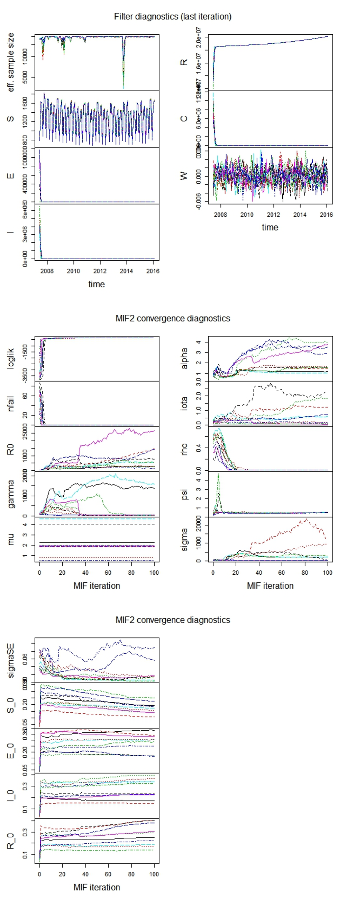
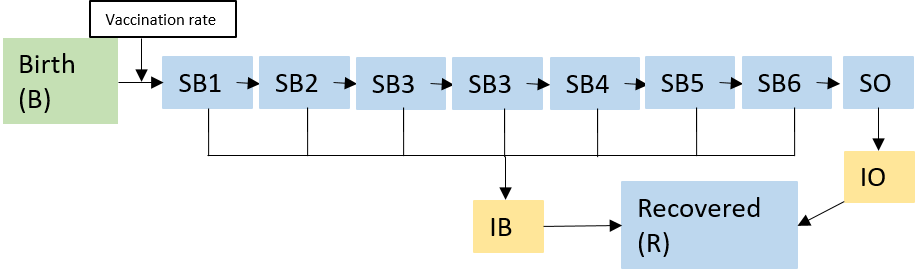
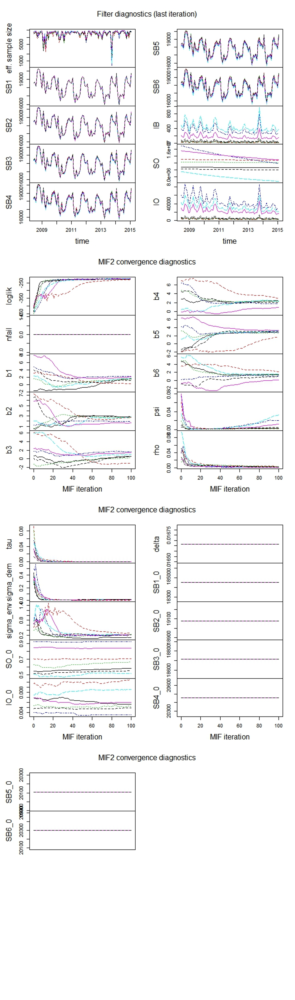

```{r, echo=FALSE}
library(knitr)
prefix <- "projectHPA"
opts_chunk$set(
  progress=TRUE,
  prompt=FALSE,tidy=FALSE,highlight=TRUE,
  strip.white=TRUE,
  warning=FALSE,
  message=FALSE,
  error=FALSE,
  echo=TRUE,
  cache=TRUE,
  cache.extra=rand_seed,
  results='markup',
  fig.show='asis',
  size='small',
  fig.lp="fig:",
  fig.path=paste0("figure/",prefix,"-"),
  cache.path=paste0("cache/",prefix,"-"),
  fig.pos="h!",
  fig.align='center',
  fig.height=4,fig.width=6.83,
  dpi=300,
  dev='png',
  dev.args=list(bg='transparent')
  )


```
```{r, echo=FALSE}
options(
  keep.source=TRUE,
  stringsAsFactors=FALSE,
  encoding="UTF-8"
  )
```


```{r, echo=FALSE}
options(cores=4)

library(plyr)
library(reshape2)
library(magrittr)
library(ggplot2)
theme_set(theme_bw())

library(pomp)
stopifnot(packageVersion("pomp")>="0.69-1")
set.seed(5996485L)
```


# A case study of acute hepatitis A infection in Florida

## 1. Introduction

<p>Hepatitis A (HPA) is a type of infectious liver disease caused by infection with hepatitis A virus (HAV) and was the most frequently reported type of hepatitis in the United States until 2004 [1]. The hepatitis A virus is transmitted primarily by ingestion of contaminated food and water or through direct contact with an infectious person [2]. In this project, I modified and applied two pomp models that were used in other disease tranmission model to describe the tansmission of acute type A viral hepatitis in Florida (2007-2016) and performed the diagnostics to evaluate the models.</p>


## 2. Data exploration

### 2.1 Data sources
<p>The dataset of acute type A viral hepatitis in Florida was exported from https://www.tycho.pitt.edu/. The report of birth by month in Florida was available at the website of Office of Economic and Demographic Research (EDR). The yearly population in Florida was obtained from http://www.flpublichealth.com. The detailed data links are listed by the end of the project.</p>

### 2.2 Dataset
<p>There are 504 records of acute type A viral hepatitis weekly report in Florida. The data during 2007-2016 was selected and used in this project. To decrease the sample size, the weekly reported cases were summarized as monthly cases.  Combined with the births and population dataset, the data is summarized as below:</p>
```{r, echo=FALSE}
dat <- read.csv("HPAFL.csv", header = T)
dat = subset(dat, select = c(5,4,7,8))

dat %>% melt(id="time") %>%
  ggplot(aes(x=time,y=value))+geom_line()+
  facet_wrap(~variable,ncol=1,scales="free_y")+
  ggtitle("Figure 1. Time plot of HPA cases, births and population")

```

## 3. HPA transmission pomp model


### 3.1 Brief overview of published articles
<p>Before choosing the models for this dataset, I did some searches online to study the exising transmission models for the HPA. Van Effelterre et al [3] developed the compartmental HPA transmission model by simulating susceptible, latent, infectious,recovered-immune and vaccinated (S-L-I-R-V) stages. The model was age-stratified. Dhankhar et al [4] esblished a model to evaluate the cost effectiveness of HPA vaccination of children in US. Besides of the basic maternal (M), susceptible (S), exposed (E) and recovered (R) stages, they also distinguished another six stages that could happen (e.g., outpatient, liver transplant etc) between E and R. Considering the comlexity of the model and the limitation of availability of age stratified population and vaccination data in Florida, I decided to start with the fundamental SEIR model.</p> 

### 3.2 SEIR model
  
#### 3.2.1 SEIR model flow diagram
  
<p>This model was created based on a SEIR model that has been used by King in a case study [5] with some variations. The flow diagram of the SEIR model was drafted as below. The model contains susceptible, exposed, infectious and recovered compartments. The birth in each month is the important input to susceptible stage.</p> 
```{r, echo=FALSE}
knitr::include_graphics("HPASEIRflow.png")
```

#### 3.2.2 Fit a SEIR model
  
<p>Two covariates were considered, birth and population. Seasonality was not included in this model since no appreciable seasonal variation in hepatitis A occurs based on CDC website [1]. But CDC also reported that cyclic increases were observed every 5- 10 years [1]. As we can see from the figure 1 in section 2, the peaks of cases of HPA seem to happen at the same time when the peaks of birth appear.</p>
```{r}
covar<- data.frame(
  time=dat$time,
  birthrate=dat$births,
  pop=predict(smooth.spline(x=2007:2016,y=na.omit(dat$pop[12*(1:24)])),x=dat$time)$y
)


rproc <- Csnippet("
  double beta, foi, dw, births;
                  double rate[6], trans[6];
                  
                  // transmission rate
                  beta = R0*(gamma+mu);
                  // expected force of infection
                  foi = beta*pow(I+iota,alpha)/pop;
                  // white noise (extrademographic stochasticity)
                  dw = rgammawn(sigmaSE,dt);
                  
                  rate[0] = foi*dw/dt;  // stochastic force of infection
                  rate[1] = mu;             // natural S death
                  rate[2] = sigma;        // rate of ending of latent stage
                  rate[3] = mu;             // natural E death
                  rate[4] = gamma;        // recovery
                  rate[5] = mu;             // natural I death
                  
                  // Poisson births
                  births = rpois(birthrate*dt);
                  
                  // transitions between classes
                  reulermultinom(2,S,&rate[0],dt,&trans[0]);
                  reulermultinom(2,E,&rate[2],dt,&trans[2]);
                  reulermultinom(2,I,&rate[4],dt,&trans[4]);
                  
                 
                  S += births   - trans[0] - trans[1] ;
                  
                  E += trans[0] - trans[2] - trans[3];
                  I += trans[2] - trans[4] - trans[5];
                  R = pop - S - E - I ;
                  W += (dw - dt)/sigmaSE;  // standardized i.i.d. white noise
                  C += trans[4];           // true incidence
                  ")

initlz <- Csnippet("
  double m = pop/(S_0+E_0+I_0+R_0);
                   S = nearbyint(m*S_0);
                   E = nearbyint(m*E_0);
                   I = nearbyint(m*I_0);
                   R = nearbyint(m*R_0);
                   W = 0;
                   C = 0;
                   ")

dmeas <- Csnippet("
  double m = rho*C;
  double v = m*(1.0-rho+psi*psi*m);
  double tol = 1.0e-18;
  if (cases > 0.0) {
    lik = pnorm(cases+0.5,m,sqrt(v)+tol,1,0)-pnorm(cases-0.5,m,sqrt(v)+tol,1,0)+tol;
  } else {
    lik = pnorm(cases+0.5,m,sqrt(v)+tol,1,0)+tol;
  }
")


rmeas <- Csnippet("
                  double m = rho*C;
                  double v = m*(1.0-rho+psi*psi*m);
                  double tol = 1.0e-18;
                  cases = rnorm(m,sqrt(v)+tol);
                  if (cases > 0.0) {
                  cases = nearbyint(cases);
                  } else {
                  cases = 0.0;
                  }
                  ")
t0= 2007+4/12
hav<-pomp(
  data=subset(dat, (time > t0 + 0.01) & (time < 2016+1/12+0.01),	
                   select=c("cases","time")),
       time="time",
       t0= t0,
       rprocess = euler.sim(step.fun = rproc, delta.t=1/12),
       initializer=initlz,
       dmeasure=dmeas,
       rmeasure=rmeas,
       covar=covar,
       tcovar="time",
       zeronames=c("C","W"),
       statenames=c("S","E","I","R","C","W"),
       paramnames=c("R0","mu","sigma","gamma","alpha","iota",
                    "rho","sigmaSE","psi",
                    "S_0","E_0","I_0","R_0")
)

toEst <- Csnippet("
                  Tmu = log(mu);
                  Tsigma = log(sigma);
                  Tgamma = log(gamma);
                  Talpha = log(alpha);
                  Tiota = log(iota);
                  Trho = logit(rho);
                  
                  TsigmaSE = log(sigmaSE);
                  Tpsi = log(psi);
                  TR0 = log(R0);
                  to_log_barycentric (&TS_0, &S_0, 4);
                  ")

fromEst <- Csnippet("
                    Tmu = exp(mu);
                    Tsigma = exp(sigma);
                    Tgamma = exp(gamma);
                    Talpha = exp(alpha);
                    Tiota = exp(iota);
                    Trho = expit(rho);
                    
                    TsigmaSE = exp(sigmaSE);
                    Tpsi = exp(psi);
                    TR0 = exp(R0);
                    from_log_barycentric (&TS_0, &S_0, 4);
                    ")


pomp(hav,toEstimationScale=toEst,
     fromEstimationScale=fromEst,
     statenames=c("S","E","I","R","C","W"),
     paramnames=c("R0","mu","sigma","gamma","alpha","iota",
                  "rho","sigmaSE","psi",
                  "S_0","E_0","I_0","R_0")) -> hav

hav %>% as.data.frame() %>% 
  melt(id="time") %>%
  ggplot(aes(x=time,y=value))+
  geom_line()+
  facet_grid(variable~.,scales="free_y")+
  ggtitle("Figure 2. Plot of initial pomp model")
```
<p> Simulation</p>
```{r,echo=FALSE}
params=c( R0=0.001,
          mu=0.002,
          sigma=0.002,
          gamma=0.002,
          alpha=1,
          iota=1,
          rho=0.02,
          sigmaSE=0.02,
          psi=0.0002,
          S_0=0.02,
          E_0=0.02,
          I_0=0.02,
          R_0=0.02)

simulate(hav,params=params,
         nsim=9,as.data.frame=TRUE,include.data=TRUE) -> sims

ggplot(data=sims,mapping=aes(x=time,y=cases,group=sim,color=(sim=="data")))+
  geom_line()+
  scale_color_manual(values=c(`TRUE`="blue",`FALSE`="red"))+
  guides(color=FALSE)+
  facet_wrap(~sim,ncol=2)+
  scale_y_sqrt()+
  theme_bw()+theme(strip.text=element_blank()) +
  ggtitle("Figure 3. Initial simulation")-> simplot
simplot
```


#### 3.2.3 Parameter estimation

<p>A global search was performed.</p>
```{r,echo=FALSE}
library(foreach)
library(doParallel)
registerDoParallel()

cores <- 4  
registerDoParallel(cores)
mcopts <- list(set.seed=TRUE)
set.seed(318817883,kind="L'Ecuyer")

```

```{r}

run_level <- 2
switch(run_level,
       {hpa_Np=100; hpa_Nmif=10; hpa_Neval=10; hpa_Nglobal=100; hpa_Nlocal=10}, 
       {hpa_Np=20000; hpa_Nmif=100; hpa_Neval=10; hpa_Nglobal=100; hpa_Nlocal=10} 
       
)

hpa_box1 <- rbind(
  R0=c(29,40),
  gamma=c(60,169),
  mu=c(0,5),
  alpha=c(.7,1),
  iota=c(0,.4),
  rho=c(.15,.65),
  psi=c(.15,.5),
  sigma=c(41,56),
  sigmaSE=c(.03,.09),
  S_0=c(.03,.09),
  E_0=c(.03,.09),
  I_0=c(.03,.09),
  R_0=c(.03,.09)
)

stew(file=sprintf("box_eval-%d.rda",run_level),{
  
    t_global <- system.time({
    mifs_global1 <- foreach(i=1:hpa_Nglobal,.packages='pomp', .combine=c, .options.multicore=mcopts, .export = ls(globalenv())) %dopar%  
      mif2(
        hav,
        start=c(apply(hpa_box1,1,function(x)runif(1,x[1],x[2]))),
        Np=hpa_Np,
        Nmif=hpa_Nmif,
        cooling.type="geometric",
        cooling.fraction.50=0.5,
        transform=TRUE,
        rw.sd=rw.sd(
          R0=0.02,
          sigma=0.02,
          gamma=0.02,
          alpha=0.02,
          iota=0.02,
          rho=0.02,
          sigmaSE=0.02,
          psi=0.02,
          S_0=ivp(0.02),
          E_0=ivp(0.02),
          I_0=ivp(0.02),
          R_0=ivp(0.02))
      )
        like_m2 <- foreach(i=1:hpa_Nlocal,.packages='pomp',
                           .combine=rbind,.options.multicore=list(set.seed=TRUE),.export = ls(globalenv())) %dopar% 
                           {
                             logmeanexp(
                               replicate(hpa_Neval,
                                         logLik(pfilter(hav,params=coef(mifs_global1 [[i]]),Np=hpa_Np))
                               ),
                               se=TRUE)
                           }
    })
},seed=318817883,kind="L'Ecuyer")


ra2 <- data.frame(logLik=like_m2[,1],logLik_se=like_m2[,2],t(sapply(mifs_global1,coef)))
if (run_level>1) 
  write.table(ra2,file="ha_params_1.csv",append=TRUE,col.names=FALSE,row.names=FALSE)
summary(ra2$logLik,digits=5)
```

```{r}
pairs(~logLik+S_0+E_0+I_0+R_0,data=subset(ra2,logLik>max(logLik)-550), main="Figure 4. Geometry of the likelihood surface")
```
<p>Figure 5. Diagnostics and maximization convergence</p>
```{r, echo=FALSE}
#plot(mifs_global1)
echo=FALSE


```


```{r, echo=FALSE}
idx <- which.max(ra2$logLik)
hav_mle <- unlist(ra2[idx,])
simulate(hav,params=hav_mle,
         nsim=9,as.data.frame=TRUE,include.data=TRUE) -> sims2
ggplot(data=sims2,mapping=aes(x=time,y=cases,group=sim,color=(sim=="data")))+
  geom_line()+
  scale_color_manual(values=c(`TRUE`="blue",`FALSE`="red"))+
  guides(color=FALSE)+
  facet_wrap(~sim,ncol=2)+
  scale_y_sqrt()+
  theme_bw()+theme(strip.text=element_blank()) +
  ggtitle("Figure 6. Simulation")-> simplot2
simplot2
```

#### 3.2.4 Discussion
  
<p>It seems that the simulation from the fitter model didn't match the data. Other parameter boxes were also tried to provide possible solutions. However, either the fitting cannot be carried out or the estimated parameter didn't catch the shape of the data (those trials are not shown here). I also tried to include the vaccination status of HPA in the model but the fitting was not successful. The possible explanation for the results may include: 1) the vaccination situation is complex. Only the average vaccination rate is available to me and the input from birth to susceptibles was computed based on the rate; 2) most of the published papers used age-stratified models due to the age dependent sychrom and vaccination status (more discussions in the next section). In conclusion, more parameters and data are needed to modify the standard SEIR model to fit this HPA dataset.</p>


### 3.3 Second pomp model
  
<p>Next I construct a similar model with the one established by Inoides and King [6] where they implement the compartmental model of Martinez-Bakker et al [7] to represent susceptible babies in each of six one-month birth cohorts (SB1 to SB 6), susceptible older individuals (SO), infected babies (IB), infected older individuals (IO) and individuals who have recovered with lifelong immunity (R) [6]. The motivation of potential utility of this model in this HPA project included: 1)  younger children often have no symptoms of HPA while older children and adult may feel very sick [8]; 2) lifelong immunity to HPA will be produced after HAV infection [1]; 3) hepatitis A vaccine may be given to babies as young as 6 months when it is necessary [9]. I also investigated the vaccination status of HPA. 95% of cases received HPA vaccine will have immunity for at least fifteen years and possibly entire life [10-11]. According to a record in 2014, the vaccination rate among children aged 19-35 months in Florida was 55% [12].</p>

#### 3.3.1 Model flow diagram
  
<p>Based on the previous work from Inoides and King [6], the following diagram was plotted. The vaccination rate was introduced as a constant coefficient to modify the births input.</p>
```{r, echo=FALSE}
echo=FALSE

```

#### 3.3.2 Model implementation

<p>The theory of this model was introduced by Martinez-Bakker et al [7]. Briefly, (the following description was adapted from 531/w18 class note) the mean force of infection was modeled as $\bar\lambda_n=\left( \beta_n \frac{I^O_n+I^B_n}{P_n} + \psi \right)$, where $P_n$ is population interpolated to time $t_n$. The stochastic perturbation of force of infection is $\lambda_n = \bar\lambda_n \epsilon_n$. Seasonality of transmission is modeled as $\beta_n=\exp\left\{ \sum_{k=1}^K b_k\xi_k(t_n) \right\}$ with ${\xi_k(t),k=1,\dots,6}$ being a periodic B-spline basis. The chance of remaining in the susceptible population when exposed to these hazards for one month is $p_n = \exp\left\{-\frac{\delta+\lambda_n}{12}\right\}$ and the chance of infection is $q_n = (1-p_n)\lambda_n\big/(\lambda_n+\delta)$. $B_n$ is births in month $n$. The full model is shown below [6]: </p>

$$\begin{array}
S^B_{1,n+1}&=&B_{n+1}\\
S^B_{k,n+1}&=&p_nS^B_{k-1,n} \quad\mbox{for $k=2,\dots,6$}\\
S^O_{n+1}&=& p_n(S^O_n+S^B_{6,n})\\
I^B_{n+1}&=& q_n \sum_{k=1}^6 S^B_{k,n}\\
I^O_{n+1}&=& q_n S^O_n
\end{array}$$

There are parameters $\big(\tilde S^B_{1,0},...,\tilde S^B_{6,0}, \tilde I^B_0,\tilde I^O_0,\tilde S^O_0\big)$ that specify the population in each compartment at time $t_0$ via
$$ S^B_{1,0}= {\tilde S}^B_{1,0} ,...,S^B_{6,0}= \tilde S^B_{6,0}, \quad I^B_{0}= P_0 \tilde I^B_{0},\quad S^O_{0}= P_0 \tilde S^O_{0}, \quad I^O_{0}= P_0 \tilde I^O_{0}.$$
  
```{r, echo=FALSE}
hpa_data =dat

```


```{r}
statenames <- c("SB1","SB2","SB3","SB4","SB5","SB6","IB","SO","IO")
t0= 2008+4/12
bspline_basis <- periodic.bspline.basis(
  hpa_data $time,nbasis=6,degree=3,period=1,names="xi%d")
covartable <- data.frame(
  time=hpa_data $time,
  B=hpa_data $births,
  P=predict(smooth.spline(x=2007:2016,y=na.omit(hpa_data$pop[12*(1:24)])),
            x=hpa_data$time)$y,
  bspline_basis
)

rp_names <- c("b1","b2","b3","b4","b5","b6","psi","rho","tau","sigma_dem","sigma_env")

ivp_names <- c("SO_0","IO_0")

i <- which(abs(covartable$time-t0)<0.01)
initial_births <- as.numeric(covartable$B[i-0:5])
names(initial_births) <- c("SB1_0","SB2_0","SB3_0","SB4_0","SB5_0","SB6_0") 
fixed_params <- c(delta=1/60,initial_births)
fp_names <- c("delta","SB1_0","SB2_0","SB3_0","SB4_0","SB5_0","SB6_0")

rproc <- Csnippet("
                  double beta = exp(dot_product(K, &xi1, &b1));
                  double lambda = (beta * (IO+IB) / P + psi);
                  double var_epsilon = pow(sigma_dem,2)/lambda +  sigma_env*sigma_env;
                  lambda *= (var_epsilon < 1.0e-6) ? 1 : rgamma(1/var_epsilon,var_epsilon);
                  double p = exp(-(delta+lambda)/12);
                  double q = (1-p)*lambda/(delta+lambda);
                  SB1 = B*0.45;
                  SB2 = SB1*p;
                  SB3 = SB2*p;
                  SB4 = SB3*p;
                  SB5 = SB4*p;
                  SB6 = SB5*p;
                  SO = (SB6+SO)*p;
                  IB = (SB1+SB2+SB3+SB4+SB5+SB6)*q;
                  IO = SO*q;
                  ")


dmeas <- Csnippet("
                  double tol = 1.0e-25;
                  double mean_cases = rho*IO;
                  double sd_cases = sqrt(pow(tau*IO,2) + mean_cases);
                  if (cases > 0.0) {
                  lik = pnorm(cases+0.5,mean_cases,sd_cases,1,0) - pnorm(cases-0.5,mean_cases,sd_cases,1,0) + tol; 
                  } else{
                  lik = pnorm(cases+0.5,mean_cases,sd_cases,1,0) + tol;
                  }
                  if (give_log) lik = log(lik);
                  ")

rmeas <- Csnippet("
                  cases = rnorm(rho*IO, sqrt( pow(tau*IO,2) + rho*IO ) );
                  if (cases > 0.0) {
                  cases = nearbyint(cases);
                  } else {
                  cases = 0.0;
                  }
                  ")

init <- Csnippet("
                 SB1 = SB1_0;
                 SB2 = SB2_0;
                 SB3 = SB3_0;
                 SB4 = SB4_0;
                 SB5 = SB5_0;
                 SB6 = SB6_0;
                 IB = 0;
                 IO = IO_0 * P;
                 SO = SO_0 * P;
                 ")


toEst <- Csnippet("
                  Tpsi = log(psi);
                  Trho = logit(rho);
                  Ttau = log(tau);
                  Tsigma_dem = log(sigma_dem);
                  Tsigma_env = log(sigma_env);
                  TSO_0 =  logit(SO_0);
                  TIO_0 = logit(IO_0);
                  ")

fromEst <- Csnippet("
                    Tpsi = exp(psi);
                    Trho = expit(rho);
                    Ttau = exp(tau);
                    Tsigma_dem = exp(sigma_dem);
                    Tsigma_env = exp(sigma_env);
                    TSO_0 =  expit(SO_0);
                    TIO_0 = expit(IO_0);
                    ")

params <- c(b1=0.3,b2=0.1,b3=1.5,b4=0.6,b5=0.5,b6=0.3,psi=0.002,rho=0.01,tau=0.01,
            sigma_dem=0.04,sigma_env=0.5,SO_0=0.12,IO_0=0.001,fixed_params)


hpav <- pomp(
  data=subset(hpa_data, 
              (time > t0 + 0.01) & (time < 2015+1/12+0.01),	
              select=c("cases","time")),
  times="time",
  t0=t0,
  params=params,
  rprocess = euler.sim(step.fun = rproc, delta.t=1/12),
  rmeasure = rmeas,
  dmeasure = dmeas,
  covar=covartable,
  tcovar="time",
  statenames = statenames,
  paramnames = c(rp_names,ivp_names,fp_names),
  initializer=init,
  toEstimationScale=toEst, 
  fromEstimationScale=fromEst,
  globals="int K = 6;"
)
plot(hpav, main="Figure 7. Second pomp model")
```

<p> Simulation </p>
```{r, echo=FALSE}
simulation1 <- simulate(hpav,nsim=9,as.data.frame=TRUE,include.data=TRUE)
ggplot(data=simulation1,mapping=aes(x=time,y=cases,group=sim,color=(sim=="data")))+
  geom_line()+
  scale_color_manual(values=c(`TRUE`="blue",`FALSE`="red"))+
  guides(color=FALSE)+
  facet_wrap(~sim,ncol=2)+
  scale_y_sqrt()+
  theme_bw()+theme(strip.text=element_blank()) +
  ggtitle("Figure 8. Initial simulation")-> simulationplot1
simulationplot1
```


#### 3.3.3 Parameter estimation
```{r}
hpa_rw.sd_rp <- 0.02
hpa_rw.sd_ivp <- 0.2
hpa_cooling.fraction.50 <- 0.5

stew(sprintf("mif-%d.rda",run_level),{
  t2 <- system.time({
    m2 <- foreach(i=1:hpa_Nlocal,
                  .packages='pomp', .combine=c,
                  .options.multicore=list(set.seed=TRUE),.export = ls(globalenv())) %dopar% try(
                    mif2(hpav,
                         Np=hpa_Np,
                         Nmif=hpa_Nmif,
                         cooling.type="geometric",
                         cooling.fraction.50=hpa_cooling.fraction.50,
                         transform=TRUE,
                         rw.sd=rw.sd(
                           b1=0.02,
                           b2=0.02,
                           b3=0.02,
                           b4=0.02,
                           b5=0.02,
                           b6=0.02,
                           psi=0.02,
                           rho=0.02,
                           tau=0.02,
                           sigma_dem=0.02,
                           sigma_env=0.02,
                           IO_0=ivp(0.02),
                           SO_0=ivp(0.02)
                         )
                    )
                  )
    
    lik_m2 <- foreach(i=1:hpa_Nlocal,.packages='pomp',
                      .combine=rbind,.options.multicore=list(set.seed=TRUE),.export = ls(globalenv())) %dopar% 
                      {
                        logmeanexp(
                          replicate(hpa_Neval,
                                    logLik(pfilter(hpav,params=coef(m2[[i]]),Np=hpa_Np))
                          ),
                          se=TRUE)
                      }
  })
},seed=318817883,kind="L'Ecuyer")

r2 <- data.frame(logLik=lik_m2[,1],logLik_se=lik_m2[,2],t(sapply(m2,coef)))
if (run_level>1) 
  write.table(r2,file="hpa_params1.csv",append=TRUE,col.names=FALSE,row.names=FALSE)
summary(r2$logLik,digits=5)

pairs(~logLik+psi+rho+tau+sigma_dem+sigma_env,data=subset(r2,logLik>max(logLik)-20), main="Figure 9. Geometry of the likelihood surface")

```


```{r}
hpa_box <- rbind(
  b1=c(-2,8),
  b2=c(-2,8),
  b3=c(-2,8),
  b4=c(-2,8),
  b5=c(-2,8),
  b6=c(-2,8),
  psi=c(0,0.1),
  rho=c(0,0.1),
  tau=c(0,0.1),
  sigma_dem=c(0,0.5),
  sigma_env=c(0,1),
  SO_0=c(0,1),
  IO_0=c(0,0.01)
)

run_level <- 2
switch(run_level,
       {hpa_Np=100; hpa_Nmif=10; hpa_Neval=10; hpa_Nglobal=10; hpa_Nlocal=10; hpa_Nsim=50}, 
       {hpa_Np=20000; hpa_Nmif=100; hpa_Neval=10; hpa_Nglobal=10; hpa_Nlocal=10; hpa_Nsim=100} 
       
)

stew(file=sprintf("hpabox_eval-%d.rda",run_level),{
  t3 <- system.time({
    m3 <- foreach(i=1:hpa_Nglobal,.packages='pomp',.combine=c,
                  .options.multicore=list(set.seed=TRUE),.export = ls(globalenv())) %dopar%  
      mif2(
        m2[[1]],
        start=c(apply(hpa_box,1,function(x)runif(1,x[1],x[2])),fixed_params)
      )
    
    lik_m3 <- foreach(i=1:hpa_Nglobal,.packages='pomp',.combine=rbind,
                      .options.multicore=list(set.seed=TRUE),.export = ls(globalenv())) %dopar% {
                        set.seed(87932+i)
                        logmeanexp(
                          replicate(hpa_Neval,
                                    logLik(pfilter(hpav,params=coef(m3[[i]]),Np=hpa_Np))
                          ), 
                          se=TRUE)
                      }
  })
},seed=318817883,kind="L'Ecuyer")


r3 <- data.frame(logLik=lik_m3[,1],logLik_se=lik_m3[,2],t(sapply(m3,coef)))
if(run_level>1) write.table(r3,file="hpa_params.csv",append=TRUE,col.names=FALSE,row.names=FALSE)
summary(r3$logLik,digits=5)

pairs(~logLik+psi+rho+tau+sigma_dem+sigma_env,data=subset(r3,logLik>max(logLik)-20),main="Figure 10. Geometry of the likelihood surface")


idx <- which.max(r3$logLik)
hpav_mle <- unlist(r3[idx,])


simulate(hpav,params=hpav_mle,
         nsim=9,as.data.frame=TRUE,include.data=TRUE) -> simulation2

ggplot(data=simulation2,mapping=aes(x=time,y=cases,group=sim,color=(sim=="data")))+
  geom_line()+
  scale_color_manual(values=c(`TRUE`="blue",`FALSE`="red"))+
  guides(color=FALSE)+
  facet_wrap(~sim,ncol=2)+
  scale_y_sqrt()+
  theme_bw()+theme(strip.text=element_blank()) +
  ggtitle ("Figure 11. Simulation")-> simulationplot2
simulationplot2
```
<p>Figure 12. Diagnostics and maximization convergence</p>
```{r, echo=FALSE}
#plot(m3[r3$logLik>max(r3$logLik)-10])
echo=FALSE


```

#### 3.3.4 Discussion
<p> The best parameter sets via global search are obtained and the diagnostic plots are shown above. Evaluation of the best result of this search gives a likelihood of -220.18. Most of the convengence seemed to be fine, though more iterations are needed to make the results convincing. Increasing the number of particles may enhance the performance. From the simulation, we can tell the second model describes more characters of the data compared to the first model. But I also notice for some of the peaks in the simulation, there are slightly shift around the peaks of data. These results maybe due to the vaccination rate variation during those time periods.  </p>

# Summary
<p> Due to the limitation of data and complexity of the transmission of HPA, I started the study of this dataset by modifying and applying the similar models that have been used in other infectious disease. Age-stratified model is needed to describe this transmission process due to the different status of vaccination and syndrome. The second model that has been established by Martinez-Bakker and King in polio case study provided a good basis for the study of HPA transmission model after some variations. To further evaluate the utility of this model, deeper diagnostics are needed. The evaluations in this project are limited due to the long computation time. To improve the model, the next steps could be performed include: classify the age into different groups and include different vaccination rate in each group.</p>

## References
<p>[1] https://www.cdc.gov/vaccines/pubs/pinkbook/hepa.html </p>
<p>[2] http://www.who.int/en/news-room/fact-sheets/detail/hepatitis-a</p>
<p>[3] Van Effelterre, Thierry P., et al. "A mathematical model of hepatitis a transmission in the United States indicates value of universal childhood immunization." Clinical infectious diseases 43.2 (2006): 158-164.</p>
<p>[4] Dhankhar, Praveen, et al. "Public health impact and cost-effectiveness of hepatitis A vaccination in the United States: a disease transmission dynamic modeling approach." Value in Health 18.4 (2015): 358-367.</p>
<p>[5] https://kingaa.github.io/sbied/measles/measles.html</p>
<p>[6] https://kingaa.github.io/sbied/polio/polio.html </p>
<p>[7] Martinez-Bakker, M., A. A. King, and P. Rohani. 2015. Unraveling the transmission ecology of polio. PLoS Biology 13:e1002172.</p>
<p>[8] https://www.cdc.gov/vaccines/parents/diseases/child/hepa.html</p>
<p>[9] https://www.caringforkids.cps.ca/handouts/hepatitis_a</p>
<p>[10] "WHO position paper on hepatitis A vaccines - June 2012" (PDF). Wkly Epidemiol Rec. 87 (28/29): 261-76. 13 July 2012. PMID 22905367.</p>
<p>[11] Ott JJ, Irving G, Wiersma ST (December 2012). "Long-term protective effects of hepatitis A vaccines. A systematic review". Vaccine. 31 (1): 3-11. doi:10.1016/j.vaccine.2012.04.104. PMID 22609026.</p>
<p>[12] https://www.cdc.gov/mmwr/preview/mmwrhtml/mm6433a1.htm#Tab1 </p>

## Data resources
<p>Florida HPA cases: https://www.tycho.pitt.edu/ </p>
<p>Florida population: http://edr.state.fl.us/Content/population-demographics/data/index-floridaproducts.cfm </p>
<p>Florida births: http://www.flpublichealth.com/VSBOOK/VSBOOK.aspx </p>

##R code resources
<p> Ionides, 531w18 class resources (class notes 11-13 and case study): https://ionides.github.io/531w18/ </p>
<p> King and Ionides, Simulation-based Inference for Epidemiological Dynamics: https://kingaa.github.io/sbied/index.html (Case study: measles and Case study: polio.)</p>
<p> 531w16 Final project: 
<p> Mengjiao Zhang, Case study of Mumps transmission;</p>
<p> Anonymous, Rubella and its Vaccination in Michigan from 1969 to 1980</p>


