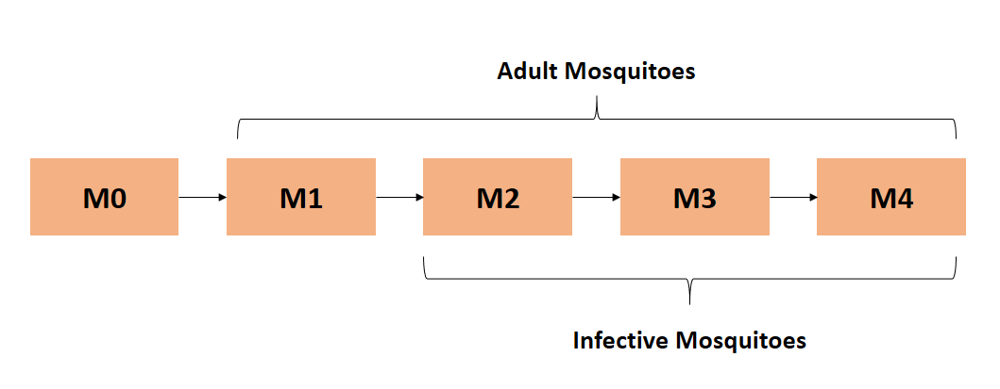
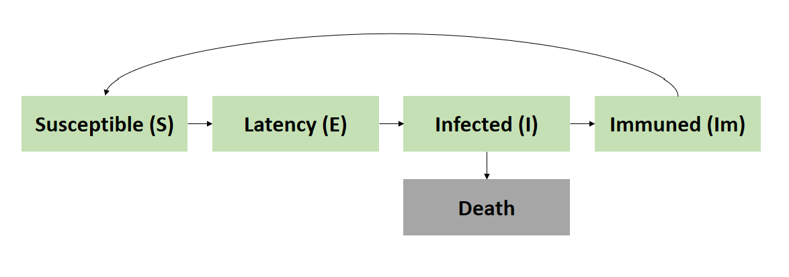
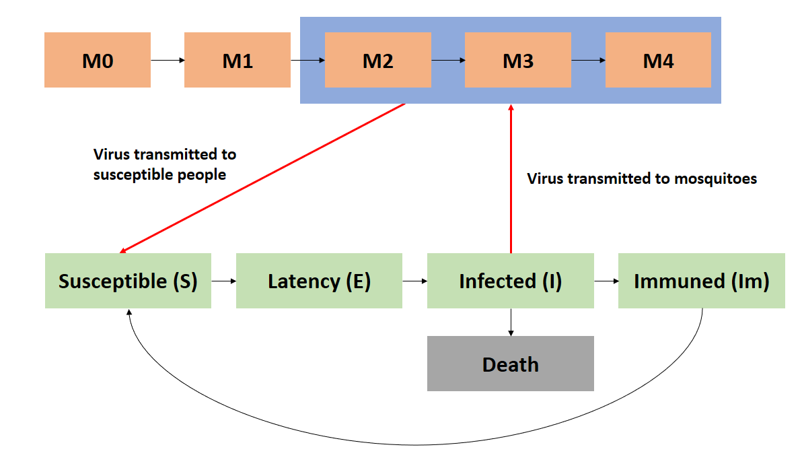

\newcommand\prob{\mathbb{P}}
\newcommand\E{\mathbb{E}}


```{r setup, include=FALSE}
knitr::opts_chunk$set(echo = FALSE,warning = FALSE,message=FALSE)
```


```{r load_pck}
#setwd("C:/Users/yjin9/Documents/531project/final")
require(pomp)
require(foreach)
require(doParallel)
require(TSA)

require(ggplot2)
require(DiagrammeR)
#require(devtools)
#find_rtools()
#has_devel()
```

### 1. Introduction
\
#### 1.1 Dengue Epidemiology

Dengue is a viral infection commonly occur in tropical regions. Symptoms include high fever, headache, vomiting, muscle and joint pains, and a characteristic skin rash.

The viruses are transmitted through the bite of infected mosquitoes (Aedes aegypti and Aedes albopictus) that feed both indoors and outdoors during the daytime. These mosquitoes usually thrive in areas with standing water.

The virus has multiple types. Infection with one type usually gives lifelong immunity to that type, but only short-term immunity to the others. Although Dengue vaccine has been developed and launched in many countries, its usage is still limited. The main approach of disease prevention is limiting exposure to mosquito bites.

\
#### 1.2 Dengue in Malaysia

Dengue has become a global problem since the Second World War and is common in more than 110 countries. As one of tropical countries, Malaysia has suffered multiple Dengue outbreak in recent years. In 2016, Malaysia reported more than 100,000 dengue fever cases, and the outbreak was ongoing in 2017.

\
#### 1.3 Project Objective

This project aims to analyse historic Dengue incidence data to understand the epidemiologic dynamic behind the spread of this disease. The foundation of modeling is SEIR pomp model. Since the disease transmission requires the participation of mosquito, mosquito dynamic and its interaction with human Dengue spreading is also studied in this project. This improved model would help better explain Dengue incidence pattern especially when multiple outbreaks are overlapped. 

\
#### 1.4 Dataset

This project leveraged two data sources:

- Weekly Dengue incidence data from June,2012 to May,2015. The original data is from [Malaysia Open Data Portal](http://www.data.gov.my). Github user @
shikin2015 cleaned and combined the data, the detail can be found [here](http://rstudio-pubs-static.s3.amazonaws.com/156382_2b0072ac83e4448cae68771dcb68522b.html#/4).

- Precipitation data is from [World Bank Climate Change Knowledge Portal](http://sdwebx.worldbank.org/climateportal/index.cfm). Since only country level monthly data is available, I used Malaysia national monthly rainfall data as a surrogate of district level rainfall data in this analysis. Considering the climate cycle is similar across the country, this assumption is acceptable.  

\
Further data cleaning and combining performed by me can be found in R script submitted along with this report.

\
### 2. Data Exploration

Each district in Malaysia has different outbreak progress. For the purpose of this project, I narrowed down the analysis to one district, Petaling. This district was selected because its data is complete, and the dataset managed to captured two full cycle of Dengue outbreak from 2013 to 2015.

```{r data_reading}
# Read pre cleaned data
dengue.data<-read.csv("data_combined.csv")

# Extract rainfall data as covariate
covartable<-data.frame(time=dengue.data$wkid,R=dengue.data$pr)

# Extract week id and weekly Dengue incidence as observed data 
data.pomp<-dengue.data[,c("wkid","count")]
names(data.pomp)<-c("time","cases")
```

```{r data_exploration}
summary(dengue.data[,c("count","pr")])

ggplot(dengue.data, aes(wkid)) + 
  geom_line(aes(y = count, colour = "cases")) + 
  geom_line(aes(y = pr*5, colour = "precipitation")) +
  scale_x_continuous(name = "Week")
  scale_y_continuous(name = "Weekly Cases")
  scale_y_continuous(sec.axis = sec_axis(~./5, name = "Monthly Precipitation (mm)"))
```

Plotting both weekly Dengue incidence and precipitation, we can observe some correlation between both trends. The peak of precipitation precedes the peak of Dengue incidence for ~5 weeks. The pattern is reasonable, since the reproduction of mosquito has been observed to be associated with precipitaiton. As the vector of this infectious disease, larger mosquito population indicates higher possibility of disease spreading.

The incidence cases is generally continous across time axis, however, there is a significant drop during the peak period around week 85, possibly caused by missing data. This outlier may influence our analysis.

\
### 3. Basic SEIR modeling for single outbreak

The data captured two outbreak in two consecutive years. We can start our analysis with SEIR model on single outbreak. 

Dengue symptoms usually appears 4-7 days after mosquito bites, and then symptoms present for 3-10 days. The patients is only infective (through mosquitoes) during symptom phase. Therefore, a 4-compartment SEIR model is a reasonable choice to start.

```{r data_slice}
dengue1<-data.pomp[1:50,]

DiagrammeR("graph LR; S(S) --> E; E(E) --> I; I(I) --> R(R);"
           ,height=200,width=500)
```
$S = \text{susceptible}$
$E = \text{exposed and latent}$
$I = \text{infected and infectious}$
$R = \text{recovered and/or removed}$

The moving count from compartment to compartment can be simply modeled as binomial distribution over short time.

The number moving from S to E is:
$$\Delta{N_{SE}} \sim Binomial\ (S,1-e^{-\lambda I\Delta{t}})$$ 
The number moving from E to I is:
$$\Delta{N_{EI}} \sim Binomial\ (E,1-e^{-\beta\Delta{t}})$$ 

and the number moving from E to I is:
$$\Delta{N_{IR}} \sim Binomial\ (I,1-e^{-\gamma\Delta{t}})$$ 

After setting up the pomp model, I tried out different sets of parameters and conducted the simulation. It seems that the simulation has quite large variance and the model fitness is not very well: Incidence peak simulated by this model is sharper and narrower than the actual trend. SEIR model might be more suitable for infectious diseases transmitted directly between human. For Dengue fever, the dynamic of mosquitoes may play an important role, rendering the model more complicated. 

```{r basic_model}
sir_step <- Csnippet("
  double dN_SE = rbinom(S,1-exp(-se*I/N*dt));
  double dN_EI = rbinom(E,1-exp(-ei*dt));
  double dN_IR = rbinom(I,1-exp(-ir*dt));
  S -= dN_SE;
  E += dN_SE - dN_EI;
  I += dN_EI - dN_IR;
  R += dN_IR;
  H += dN_EI;
")


sir_init <- Csnippet("
  S = N-1;
  E = 1;
  I = 0;
  R = 0;
  H = 0;
")


dmeasure <- Csnippet("lik = dbinom(cases,H,rho,give_log);")
rmeasure <- Csnippet("cases = rbinom(H,rho);")

seir<-pomp(dengue1,time="time",t0=1,rprocess=euler.sim(sir_step,delta.t=1/10),
     initializer=sir_init,paramnames=c("N","se","ei","ir","rho"),
     statenames=c("S","E","I","R","H"),zeronames="H",rmeasure=rmeasure,
     dmeasure=dmeasure)
```

```{r basic_simulate}
sims <- simulate(seir,params=c(se=1.35,ei=1.65,ir=0.7,rho=0.9,N=16000),
                 nsim=20,as=TRUE,include=TRUE,seed=122)

ggplot(sims,mapping=aes(x=time,y=cases,group=sim,color=sim=="data"))+
  geom_line()+guides(color=FALSE)+ggtitle("Dengue Weekly Incidence: True Data (Blue) vs Simulation (Red)")
```

Log likelihood:
```{r basic_lik}
pf <- replicate(10,pfilter(seir,Np=5000,params=c(se=1.35,ei=1.65,ir=0.7,rho=0.9,N=16000)))
ll <- sapply(pf,logLik)
logmeanexp(ll,se=TRUE)
```

\
### 4. Inspection of Mosquito Dynamic 
\
#### 4.1 The Life Cycle of Mosquito

Mosquito is the vector of Dengue virus transmission. Mosquitoes lay eggs on still water, such as puddles after rain. The eggs take about one week to develop into adult mosquito, which can feed on human. The life span of an adult mosquito is about 3-4 weeks.

\
#### 4.2 Correlation between Precipitation and Dengue Incidence

As observed earlier, an increase in precipitation does lead the increase of Dengue incidence, which is aligned with theory. We can quantitatively examine this correlation through cross-correlation function (ccf) in R.


```{r ccf}
ccf(dengue.data$pr,dengue.data$count,lag=length(dengue.data$pr)-1,main="CCF of precipitation and Dengue Incidence")
```

A sinusoidal pattern indicates a non-linear relation between precipitation and Dengue incidence. A significant negative lag with positive ACF indicates a strong positive correlation that precipitation leads the incidence of Dengue. However, the association may not be causal, it is possible that a confounder impact both trends. 

To better identify the pattern of CCF, we can use prewhiten function to remove the potential common trend. The sinusoidal pattern almost disappear. Precipitation alone may not be adequate to explain the trend of Dengue incidence.

```{r prewhiten}
prewhiten(dengue.data$pr,dengue.data$count,main="Prewhiten CCF")
```

\
### 5. An Improved Model Leveraging Precipitation Data
\
#### 5.1 Model Setup

Since we don't have direct data on other climatic factors or population size of mosquitoes, we can try to incorporate mosquito dynamic through precipitation data. This incorporation may help us better modeling the Dengue incidence trend across multiple outbreaks. 

To simplify the model, we assume the birth of new mosquito eggs is linearly associate with precipitation, ignoring the scale. Number of mosquitos that will interact with human community follows a poisson distribution with mean $R$, where R is the precipitation(mm) at that time point. 


$$M_{0,n} \tilde{} Poisson(R)$$

It takes about one week for mosquito eggs to grow into adult mosquito which are capable of feeding on human. After mosquito acquiring Dengue virus from human patients, it takes about one week for the virus to reproduce in mosquito's blood stream before it becomes infective to other human. Mosquito carried Dengue virus can spread the disease to other human throughout its entire adult life span, which is about four weeks. 

Therefore, the compartmental model of mosquito can be constructed as:



- Flowing from one compartment to the next, a fixed proportion of mosquito dies. The proportion is set as $m_{death} = 0.1$.




For human side of the dynamic model, we keep the SEIR model structure, with following improvements:

- For all susceptible individuals, the chance of remaining in the susceptible population is:

$$p_n = exp\{-\lambda_n\}$$

$$\Delta N_{SE} = (1-p_n) \times S_n$$

- Since almost all dengue infected patients will show obvious sympotoms one week after infection bites, we can move all latency patients to infected pool at every step:

$$\Delta N_{EI} = E_n$$

- Every week, a porportion of Dengue infected people die. In Malaysia, the case fatality of Dengue is $\delta$ = 2.72%

$$N_{death} = I_n \times \delta$$


- For survived Dengue patients, the number of patients moving from infected to immuned follows poisson distribution with an upper limit $I_n$:

$$\Delta N_{II_m} \sim Poisson(k_{i\_im} \times(1-\delta) \times I_n)$$

$$\Delta N_{II_m} \leq I_n $$

Parameter $k_{i\_im}$ is unknown.

- Dengue has many types, although infected patients acquire lifelong immunity to the specific type, they only acquire short-term immunity to other types, i.e, it is possible that they will get Dengue again. So every week, a fraction of immuned pool moves back to susceptible pool to reflect this dynamic.

$$\Delta N_{ImS} \sim Poisson(k_{im\_s} \times Im_n) $$

$$\Delta N_{ImS} \leq Im_n$$
Parameter $k_{im\_s}$ is unknown.

- Natural birth and death of studied population is ignored. Total population in Petaling is set as 1.66 Million. 

\
In summary, the change of states at each time step is:

- $\Delta S = \Delta N_{ImS} - \Delta N_{SE}$

- $\Delta E = \Delta N_{SE} - \Delta N_{EI}$

- $\Delta I = \Delta N_{EI} - \Delta N_{IIm} - \Delta N_{death}$

- $\Delta Im = \Delta N_{IIm} - \Delta N_{ImS}$




\
- The infection force is modeled as related to both the absolute size of adult mosquito population among human community $M_{2,n} + M_{3,n} + M_{4,n}$ and the relative size of infected Dengue patients $I_n/P_n$:

$$\bar{\lambda_n}= \frac{(M_{2,n} + M_{3,n} + M_{4,n})\times I_n \times \beta}{P_n}+\psi$$

- The force of infection has a stochastic perturbation, 1000 was added to adjust the scale of $\lambda$. $\sigma_{env}^2$, $\sigma_{dem}^2$, $\beta$, $\phi$ are unknown parameters.

$$\lambda_n = \frac{\bar{\lambda_n} \times \epsilon_n}{1000}$$ 

$\epsilon_n$ follows Gamma distribution with mean 1 and variance:

$$\sigma^2=\sigma_{env}^2+\sigma_{dem}^2/\bar{\lambda_n}$$


For initial state, the proportion of latency, infected, and immuned are set to be unknown parameters.

For observations, it is a discretized normal distribution truncated at zero, conditional on the state, with both environmental and Poisson-scale contributions to the variance.

$$Y_n= \max{\mathrm{round}(Z_n),0}, \quad Z_n\sim\mathrm{normal}\left(\rho I_n, \big(\tau I_n\big)^2 + \rho I_n\right).$$

$\rho$ and $\tau$ are unknown parameters.

```{r pomp_input}

rp_names <- c("sigma_dem","sigma_env","beta",
              "im_s","i_im","psi","rho","tau")

fp_names <- c("md","delta","R_0","P_0")

ivp_names <- c("Er_0","Ir_0","Im_0")

state_names <- c("M0","M1","M2","M3","M4","P","S","E","I","Im")

covar_names <- "R"

obs_names <- "cases"

dengue_paramnames <- c(rp_names,ivp_names,fp_names)

dengue_rprocess <- Csnippet("
  double lambda, var_epsilon, q, Im_S,I_Im;
  lambda = (M2+M3+M4)*I/P*beta+psi;
  var_epsilon = pow(sigma_dem,2)/ lambda +  pow(sigma_env,2);
  lambda *= (var_epsilon < 1.0e-6) ? 1 : rgamma(1/var_epsilon,var_epsilon);
  lambda /=1000;
  q = 1-exp(-1*lambda);

  Im_S = rpois(im_s*Im);
  Im_S = (Im_S>Im) ? Im : Im_S;

  I_Im = rpois(i_im*I*(1-delta));
  I_Im = (I_Im>I*(1-delta)) ? (I*(1-delta)) : I_Im;

  P -= I*delta;  
  Im += (I_Im - Im_S);
  I += (E-I_Im);
  E = S*q;
  S = S*(1-q) + Im_S;
  M4=M3*(1-md);
  M3=M2*(1-md);
  M2=M1*(1-md);
  M1=M0*(1-md);
  M0=rpois(R);
")


dengue_dmeasure <- Csnippet("
  double tol = 1.0e-25;
  double mean_cases = rho*I;
  double sd_cases = sqrt(pow(tau*I,2) + mean_cases);
  if(cases > 0.0){
    lik = pnorm(cases+0.5,mean_cases,sd_cases,1,0) - pnorm(cases-0.5,mean_cases,sd_cases,1,0) + tol; 
  } else{
    lik = pnorm(cases+0.5,mean_cases,sd_cases,1,0) + tol;
  }
  if (give_log) lik = log(lik);

")


dengue_rmeasure <- Csnippet("
  cases = rnorm(rho*I, sqrt( pow(tau*I,2) + rho*I ) );
  if (cases > 0.0) {
    cases = nearbyint(cases);
  } else {
    cases = 0.0;
  }
")

dengue_initializer <- Csnippet("
  M0=R_0;
  M1=M0;
  M2=M0;
  M3=M0;
  M4=M0;
  P=P_0;
  E=P*Er_0;
  I=P*Ir_0;
  Im=P*Im_0;
  S=P-E-I-Im;

")
```

```{r pomp_transform}
dengue_toEstimationScale <- Csnippet("
 Tbeta = log(beta);
 Tmd = logit(md);
 Tim_s = logit(im_s);
 Ti_im = logit(i_im);
 Tpsi = log(psi);
 Trho = logit(rho);
 Ttau = log(tau);
 Tsigma_dem = log(sigma_dem);
 Tsigma_env = log(sigma_env);
 TEr_0 =  logit(Er_0);
 TIr_0 = logit(Ir_0);
 TIm_0 = logit(Im_0);
")

dengue_fromEstimationScale <- Csnippet("
 Tbeta = exp(beta);
 Tmd = expit(md);
 Tim_s = expit(im_s);
 Ti_im = expit(i_im);
 Tpsi = exp(psi);
 Trho = expit(rho);
 Ttau = exp(tau);
 Tsigma_dem = exp(sigma_dem);
 Tsigma_env = exp(sigma_env);
 TEr_0 =  expit(Er_0);
 TIr_0 = expit(Ir_0);
 TIm_0 = expit(Im_0);
")
```


```{r pomp_setup}
dengue.pomp <- pomp(
  data=data.pomp,
  times="time",
  t0=1,
  rprocess = euler.sim(step.fun = dengue_rprocess, delta.t=1),
  rmeasure= dengue_rmeasure,
  dmeasure = dengue_dmeasure,
  covar=covartable,
  tcovar="time",
  obsnames = obs_names,
  statenames = state_names,
  paramnames = dengue_paramnames,
  covarnames = covar_names,
  initializer=dengue_initializer,
  toEstimationScale=dengue_toEstimationScale, 
  fromEstimationScale=dengue_fromEstimationScale
)
```


```{r init_par}
fixed_params <- c(md=0.1,delta=2.72/100,R_0=150,P_0=1661000)

params<-c(Er_0=0.03,Ir_0=0.02,Im_0=0.1,beta=0.01,sigma_dem=10,sigma_env=0.01,psi=50,rho=0.6,tau=0.001,i_im = 0.7,im_s=0.05,fixed_params)

dengue.pomp<-pomp(dengue.pomp,params=params)
```


```{r run_level}
dengue_Np <-          c(100,5e3,1e4)
dengue_Nmif <-        c(10, 200,400)
dengue_Nreps_eval <-  c(2,  10,  20)
dengue_Nreps_local <- c(10, 20, 40)
dengue_Nreps_global <-c(10, 20, 80)
dengue_Nsim <-        c(50,100, 400) 
```
\
#### 5.2 Local Maximum Likelihood Search

After we set up the pomp model, mif2 algorithm is implemented to find the local maximum likelihood. Since there are many unknown parameters, the landscape of likelihood surface might be quite complex. The range of log likelihood is broad, we managed to get a loglikelihood of -629.5. 

```{r local_search}
registerDoParallel(2)
mcopts <- list(set.seed=TRUE)

run_level <-3

dengue_rw.sd_rp <- 0.02
dengue_rw.sd_ivp <- 0.2
dengue_cooling.fraction.50 <- 0.5

stew(sprintf("mif-%d.rda",run_level),{
  t2 <- system.time({
    m2 <- foreach(i=1:dengue_Nreps_local[run_level],
                  .packages='pomp',.export = ls(globalenv()), .combine=c,
                  .options.multicore=list(set.seed=TRUE)) %dopar% try(
                    mif2(dengue.pomp,
                         Np=dengue_Np[run_level],
                         Nmif=dengue_Nmif[run_level],
                         cooling.type="geometric",
                         cooling.fraction.50=dengue_cooling.fraction.50,
                         transform=TRUE,
                         rw.sd=rw.sd(
                           beta=dengue_rw.sd_rp,
                           im_s=dengue_rw.sd_rp,
                           i_im=dengue_rw.sd_rp,
                           psi=dengue_rw.sd_rp,
                           rho=dengue_rw.sd_rp,
                           tau=dengue_rw.sd_rp,
                           sigma_dem=dengue_rw.sd_rp,
                           sigma_env=dengue_rw.sd_rp,
                           Er_0=ivp(dengue_rw.sd_ivp),
                           Ir_0=ivp(dengue_rw.sd_ivp),
                           Im_0=ivp(dengue_rw.sd_ivp)
                         )
                    )
                  )
    
    lik_m2 <- foreach(i=1:dengue_Nreps_local[run_level],.packages='pomp',.export = ls(globalenv()), .combine=rbind,.options.multicore=list(set.seed=TRUE)) %dopar% 
                      {
                        logmeanexp(
                          replicate(dengue_Nreps_eval[run_level],
                                    logLik(pfilter(dengue.pomp,params=coef(m2[[i]]),Np=dengue_Np[run_level]))
                          ),
                          se=TRUE)
                      }
  })
},seed=318817883,kind="L'Ecuyer")

r2 <- data.frame(logLik=lik_m2[,1],logLik_se=lik_m2[,2],t(sapply(m2,coef)))

if (run_level>1) 
  write.table(r2,file="dengue_params.csv",append=FALSE,col.names=TRUE,row.names=FALSE)

summary(r2$logLik,digits=5)
```

```{r}
hist(r2$logLik, main="Histogram of Local Search Log Likelihoods", xlab="Log Likelihood")
```

From the pair plots, we can observe that the value of $\beta$ concentrates slight above zero. Besides, value of $\rho$ and $\tau$ are positively associated. Considering the likelihood surface is complex, there might be multiple combinations of parameters that all achieve similar likelihood.

```{r local_analysis}
pairs(~logLik+beta+im_s+i_im+psi+rho+tau+sigma_dem+sigma_env,data=subset(r2,logLik>max(logLik)-80))
```

\
#### 5.3 Global Maximum Likelihood Search

On top of the local search result we obtained earlier, we further conduct a global search to confirm the likelihood maximization. The best likelihood obtained is still around -620, which gives us some confidence about the output.

```{r global_search}
dengue_box <- rbind(
   beta=c(0,0.5),
   im_s=c(0,0.5),
   i_im=c(0.1,0.9),
   psi=c(0,100),
   rho=c(0,0.8),
   tau=c(0,0.1),
   sigma_dem=c(0,100),
   sigma_env=c(0,1),
   Er_0=c(0,0.1),
   Ir_0=c(0,0.1),
   Im_0=c(0,0.5)
)


stew(file=sprintf("box_eval-%d.rda",run_level),{
    t3_1<- system.time({
      m3 <- foreach(i=1:dengue_Nreps_global[run_level],.packages='pomp', .export = ls(globalenv()),.combine=c, .options.multicore=mcopts) %dopar%  
        try(mif2(
        m2[[1]],
        start=c(apply(dengue_box,1,function(x)runif(1,x[1],x[2])),fixed_params)
      ))
    })
},seed=1270401374,kind="L'Ecuyer")


stew(file=sprintf("lik_global_eval-%d.rda",run_level),{    
    t3_2<- system.time({ 
      lik_m3 <- foreach(i=1:dengue_Nreps_global[run_level],.packages='pomp',.export = ls(globalenv()),.combine=rbind,.options.multicore=list(set.seed=TRUE))%dopar% try({
                        set.seed(87932+i)
                        logmeanexp(
                          replicate(dengue_Nreps_eval[run_level],
                                    logLik(pfilter(dengue.pomp,params=coef(m3[[i]]),Np=dengue_Np[run_level]))
                          ), 
                          se=TRUE)
      })
      
  })
},seed=1270401374,kind="L'Ecuyer")
  
  


r3 <- data.frame(logLik=lik_m3[,1],logLik_se=lik_m3[,2],t(sapply(m3,coef)))
if(run_level>1) write.table(r3,file="dengue_params_glob.csv",append=FALSE,col.names=TRUE,row.names=FALSE)

summary(r3$logLik,digits=5)
```

We can observe that optimal parameters values are clustered in smaller region and the trend we observed from local search remains.

```{r}
pairs(~logLik+beta+im_s+i_im+psi+rho+tau+sigma_dem+sigma_env,data=subset(r3,logLik>max(logLik)-50))
```

\
#### 5.4 MLE Simulation

Using the MLE we obtained from global search, we can simulate the dynamic process to inspect the pattern of each state.

As shown in the simulation plots, the incorporation of mosquito dynamic helped us better capture the trend of Dengue incidence across outbreaks. The simulated incidence peaks lagged behind precipitation as expected. The duration of outbreaks becomes longer, which is no longer a sharp peak as shown in simple SEIR mode. Besides, the movement of immuned people back to susceptible pool help us explain the overlap of two consecutive Dengue outbreaks.   

```{r mle_simulation}

glob_params <- read.table("dengue_params_glob.csv",row.names=NULL,header=TRUE)


dengue_mle <- glob_params[which.max(glob_params[,"logLik"]),][dengue_paramnames]

dengue.pomp<-pomp(dengue.pomp,params=unlist(dengue_mle[1,]))
mle_simulation <- simulate(dengue.pomp,seed=111)
plot(mle_simulation,main="Simulation with global search MLE")
```

\
#### 5.5 Log Likelihood Convergence Diagnostic

The model has many unknown parameters and different combinations of values to achieve optimal likelihood. Therefore, the convergence of each single paramter is not guaranteed/expected. The bottom line is to achieve convergen on log likelihood. Plotting the top log likelihoods, we can see they all converge as expected.

```{r diagnostic}
loglik_convergence <- do.call(cbind,conv.rec(m3[r3$logLik>max(r3$logLik)-10],"loglik"))
matplot(loglik_convergence,type="l",lty=1,ylim=max(loglik_convergence,na.rm=T)+c(-10,0),main="Log Likelihood Convergence Inspection",ylab="Log Likelihood", xlab = "Iterations")
```


\
### 6. Conclusion

- Dengue transmission requires mosquito as vector. Standard SEIR model may not able to capture this dynamic.

- Incorporation of mosquito compartments through precipitation could help us improve the model. Although it is possible that some unknown confounders are behind both the precipitation and Dengue incidence pattern, this model is still reasonable for non-causal analysis.

- The moving from immuned pool back to susceptible pool and the seasonal change of precipitation jointly help explain the overlapped, seasonal outbreaks of Dengue in Petaling, Malaysia.


\
### 7. Future Analysis

- Compare the performance of this model with non-dynamic models.

- Add vaccine factors to study how vaccination is going to impact Dengue incidence dynamic.

- Detail modeling of Mosquito dynamics based on environmental covariates other than precipitation: Since mosquitoes are the vectors of many infectious diseases, some ecological studies have been conducted on mosquito population dynamics [(example)](https://malariajournal.biomedcentral.com/articles/10.1186/s12936-016-1411-6). Those research can be leveraged to further improve our model.

- Apply the model to broader scope: We can test the performance of this model on Dengue incidence data of other districts in Malaysia. We can also expand the time frame of data to examine the seasonality of outbreaks in a broader view.

- Conduct inference on parameters (e.g profile likelihood).

\
### 8. Reference

[1] "Dengue and severe dengue Fact sheet N°117". WHO. May 2015
\
[2] Ranjit S, Kissoon N (January 2011). "Dengue hemorrhagic fever and shock syndromes". Pediatric Critical Care Medicine. 12 (1): 90-100
\
[3] CDC Dengue Epidemiology: https://www.cdc.gov/dengue/epidemiology/index.html
\
[4] Nature Scitable Dengue Introduction: https://www.nature.com/scitable/topicpage/dengue-transmission-22399758
\
[5] Stats 531 Winter 2016 Final Projects: http://ionides.github.io/531w16/final_project/
\
[6] Stats 531 Winter 2018 Lecture Notes: https://ionides.github.io/531w18/