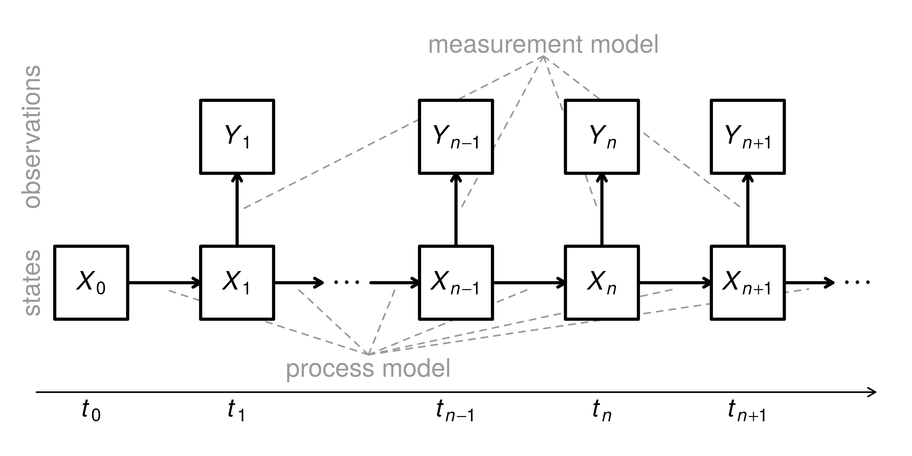

<style>
/* resize the widget container */
.plotly { 
  width: 100% !important;
}

/* center the widget */
div.svg-container {
  margin: center !important;
}
</style>

\newcommand\prob{\mathbb{P}}
\newcommand\E{\mathbb{E}}
\newcommand\var{\mathrm{Var}}
\newcommand\cov{\mathrm{Cov}}
\newcommand\loglik{\ell}
\newcommand\R{\mathbb{R}}
\newcommand\data[1]{#1^*}
\newcommand\given{\, ; \,}
\newcommand\transpose{\scriptsize{T}}


# Introduction

In this report, we focus on potential models for Nicholson's Blowflies Population, a well-known time-related data set. Several researches have been made in the past decades. The most famous one, proposed by Gurney, W.S.C et al, is the following equation,

\[
  \frac{d}{dt} N = PN(t-\tau) e^{-N(t-\tau)/N_{0}} - \delta N(t)
\]
Where $N$ is the population, and the rest are considered as parameters.    

On the other hand, there are many potential models, especially population models, might be suitable for the Nicholson's Blowflies data set. The Ricker model we covered in class note is as follow,
\[
  N_{t+1} = rN_{t}e^{-N_{t}+\epsilon_{t}}, \quad \epsilon_{t} \sim N(o, \sigma^{2})
\]
Where $N_{t}$ is the population at time $t$, and the rest are parameters. Another classic population is the Beverton-Holt model,

\[  
  N_{t+1} = \frac{aN_{t}}{1+bN_{t}}\epsilon_{t}, \quad \epsilon_{t} \sim lognormal(0, sigma^{2}).
\]
These models have been thoroughly analyzed in both the class notes and previous projects. Therefore, in this report, we try two generalized versions of Beverton-Hold model, i.e. the Hassell model and Maynard Smith-Slatkin model, and see whether they are suitable for the Nicholson's Blowflies data set.   

Specifically, referring to Pinot, A. et al, these two models can be written as follow. The Hassell Model, 

\[
  N_{t+1} = \frac{aN_{t}}{(1+bN_{t})^{\alpha}}\epsilon_{t}, \quad \epsilon_{t} \sim lognormal(0, sigma^{2}).
\]
and the Maynard Smith-Slatkin (MSS) model,
\[
  N_{t+1} = \frac{aN_{t}}{1+(bN_{t})^{\alpha}}\epsilon_{t}, \quad \epsilon_{t} \sim lognormal(0, sigma^{2}).
\]
are not so different. The $\alpha$ is the shape parameter, and it is in different positions under these two models. The random noise can be normal or log-normal. For the convenience of comparison, we stick with log-normal. As we can see, when $alpha = 1$, the Hassell model and MSS model are just Beverton-Holt model. However, an $\alpha$ other than 1 may lead to different results. 

Therefore, in this project, we explore the problem that whether Hassell Model and MSS model are suitable for Nicholson's Blowflies population. We will focus on the implementation of pomp model, although we will also spend some time fit a ARMA model as well. 

# Data Analysis and Summary

## Visualization

We will be using the entire data set. We will first take a look at the distribution of the data. The following are brief visualizations of it. 


```r
#blowfly <- read.csv("~/Google Drive/Courses/STATS_531/Final Project/blowfly.csv", header = T) # Local directory
#blowfly <- read.csv("/afs/umich.edu/user/*/*/*******/STATS531/blowfly.csv", header = T) # Server directory
blowfly <- read.csv("blowfly.csv", header = T) # Flux directory
head(blowfly)
```

```
  Day Population
1   0        948
2   2        942
3   4        911
4   6        858
5   8        801
6  10        676
```

```r
ggplot(data = blowfly, aes(x = c(1:nrow(blowfly)), y = Population)) + geom_line() + xlab("Time")
```


we can see that there actually have some kind of patterns. The data are recorded in a two days gap. Obviously, the data is periodic. The frequency domain analysis helps us to get a detailed understanding about this period. 

## Spectrum and Correlation Analysis 

The following are the spectrum plot and the acf plot of the data set. Clearly, we can see that there are periodic pattern. Approximately, the frequency is around 0.06, which is 34 days per cycle (note that the data is recorded every two days.). 

```r
spectrum(blowfly$Population, spans = c(10,10))
```


```r
acf(blowfly$Population)
```


## Decomposition

We also decompose the original data into trend, noise and cycles. There is a very obvious increasing trend after t=400. There are not notable patterns for the noise and cycle. We will then continue to a simple arma model. 

```r
Org_low <- ts(loess(Population~Day,span=0.5,data= blowfly)$fitted)
Org_hi <- ts(blowfly$Population - loess(Population~Day,span=0.1,data= blowfly)$fitted)
Org_cycles <- blowfly$Population - Org_low - Org_hi
plot(ts.union(blowfly$Population, Org_low,Org_hi,Org_cycles),
     main="Decomposition of retail revenue as trend + Sesonal + Fluctuation")
```


# Fitting the ARMA Model

Although ARMA model is not our priority concerns in this report, we will try to fit a simple model here. It can be used to perform a comparison with the later analysis of pomp model. We move on directly to the AIC selection. 


```r
## AIC for arima model selection
aic_table <- function(data,P,Q){
  table <- matrix(NA,(P+1),(Q+1))
  for(p in 0:P) {
    for(q in 0:Q) {
       table[p+1,q+1] <- arima(data,order=c(p,0,q))$aic
    }
  }
  dimnames(table) <- list(paste("<b> AR",0:P, "</b>", sep=""),paste("MA",0:Q,sep=""))
  table
}

arma_table <- aic_table(blowfly$Population, 5, 4)
require(knitr)
kable(arma_table, digits=2)
```


|            |     MA0|     MA1|     MA2|     MA3|     MA4|
|:-----------|-------:|-------:|-------:|-------:|-------:|
|<b> AR0</b> | 6657.52| 6372.00| 6220.14| 6164.83| 6126.57|
|<b> AR1</b> | 6103.31| 6098.55| 6088.49| 6088.21| 6084.50|
|<b> AR2</b> | 6095.30| 6076.37| 6073.41| 6074.94| 6071.79|
|<b> AR3</b> | 6080.30| 6073.79| 6058.02| 6077.49| 6051.66|
|<b> AR4</b> | 6078.59| 6075.70| 6077.72| 6076.13| 6072.69|
|<b> AR5</b> | 6074.81| 6075.55| 6052.09| 6073.41| 6073.10|

From the table, we can see that ARMA(3,2) has a rather small AIC, and the number of the parameter is relatively small. It is an ideal choice. The following is the summary of the model. 

```r
model <- arima(blowfly$Population, order = c(3,0,2))
model
```

```

Call:
arima(x = blowfly$Population, order = c(3, 0, 2))

Coefficients:
         ar1      ar2     ar3      ma1     ma2  intercept
      2.7360  -2.5942  0.8442  -1.7958  0.8885  3542.3209
s.e.  0.0424   0.0774  0.0391   0.0423  0.0463   358.1037

sigma^2 estimated as 1085454:  log likelihood = -3022.01,  aic = 6058.02
```

In order to see the performance of the model, we run a simple simulation, and compare it with the real data. In the following plot, the red line is the simulated data, while the black line is the original data. We can see that the simulation is quite successful. It can be considered as a good fit. However, there is still room for further improvement. For example, the seasonality should be taken into account. Better result can be expected.

```r
plot(blowfly$Population, type="l", main = "Original Data and Fitted Result")
lines(fitted(model),col="red")
```


The following is the prediction for the future time. We can see that the prediction is not very reliable, as the variable might be too large. Therefore, we will pay more attention on the pomp model in the later section. 

```r
test = forecast(model,h=20)
plot(test, main = "Testing about the prediction of ARMA")
lines(blowfly$Population, type= "l", col = "red")
```


# POMP Model Analysis: Simulations and likelihood slice

The pomp model is consisting of two models, i.e. the process model and the measurement model. The following is a schematic of the pomp model. 



As we mentioned in the previous section, we will compare the difference between Hassell Model and MSS model. Therefore, under the pomp model framework, the process model is different. They are defined as we have shown in the first section. But for simplicity, the measurement models are the same. Similarly, we will be using Poisson model.    

## Maynard Smith-Slatkin (MSS) Model

In this case, the process model is 

\[
  X_{t+1} = \frac{aX_{t}}{1+(bX_{t})^{\alpha}}\epsilon_{t}, \quad \epsilon_{t} \sim lognormal(0, \sigma^{2}).
\]
and the measurement model is
\[
  {{\quad\quad}\displaystyle Y}_{n}|P_n\;\sim\;\mathrm{Poisson}(\phi\,P_{n})
\]

There are four potential tuning parameters for the model, i.e. $a$, $b$, $\sigma$ and $\alpha$. We define the models in the pomp frame work as follow. 

```r
stochStep <- Csnippet("epsN = rlnorm(0, sigma*sigma);
                        N = (a*N/(1+pow(N/b,alpha)))*epsN;")

rmeas <- Csnippet("Population = rpois(phi*N);")
dmeas <- Csnippet("lik = dpois(Population, phi*N, give_log);")

blowfly_MSS <- pomp(blowfly,
     times = "Day", t0 = 0,
     rprocess = discrete.time.sim(step.fun = stochStep, delta.t = 2),
     paramnames = c("a", "b", "sigma", "alpha", "phi"),
     statenames = c("N", "epsN"),
     rmeasure = rmeas,
     dmeasure = dmeas
     ) 
```

When the model is properly defined, we can do several simulations and compare it with the original data. 

```r
coef(blowfly_MSS) <- c(N.0 = 948, epsN.0 = 0, a = 2.5, b = 1400, sigma = 0.8, phi = 1, alpha = 0.8)
sims <- simulate(blowfly_MSS, nsim=3, as.data.frame = TRUE, include.data = TRUE)
ggplot(data = sims, mapping = aes(x = time, y = Population)) + geom_line() + facet_wrap(~sim)
```


From the plots above, we can see that the simulated data comparable to the original data. The peaks are basically the same. On the other hand, trends and clear cycle fail to show up in the simulated data. But still, we consider the MSS model appropriate.       

Then, we can have a look at the likelihood slice to have a general idea of the choice of each parameter.    

```r
sliceDesign(
    c(N.0=948, epsN.0=0, a=2.5, b=2000, sigma=0.7, phi=1, alpha=1),
    a=rep(seq(from=1,to=3,length=50),each=3),
    b=rep(seq(from=1000,to=5000,length=50),each=3),
    sigma=rep(seq(from=0.6,to=1.0,length=50),each=3),
    alpha=rep(seq(from=0.3,to=1.0,length=50),each=3)
  ) -> p

blowfly_mle=unlist(p[which.max(p$loglik),])

require(foreach)
require(doMC)

registerDoMC(cores=20)   

set.seed(998468235L,kind="L'Ecuyer")
mcopts <- list(preschedule=FALSE,set.seed=TRUE)

foreach (theta=iter(p,"row"),.combine=rbind,
         .inorder=FALSE,.options.multicore=mcopts) %dopar% 
         {
           pfilter(blowfly_MSS,params=unlist(theta),Np=5000) -> pf
           theta$loglik <- logLik(pf)
           theta
         } -> p

foreach (v=c("a","b","sigma", "alpha")) %do% 
{
  x <- subset(p,slice==v)
  plot(x[[v]],x$loglik,xlab=v,ylab="loglik")
}
```


From the plots, we can see clear peaks for almost all tuning parameters. It seems that 2.5 is the best choice for $a$, 2500 for $b$, 0.77 for $\sigma$ and 0.3 for $\alpha$. For each parameter, there are three simulations. We can see that $a$, $b$ and $\sigma$ are relatively stable compared to $\alpha$. 


## Hassell Model

In this case, the process model is 

\[
  X_{t+1} = \frac{aX_{t}}{(1+bX_{t})^{\alpha}}\epsilon_{t}, \quad \epsilon_{t} \sim lognormal(0, \sigma^{2}).
\]
and the measurement model is
\[
  {{\quad\quad}\displaystyle Y}_{n}|P_n\;\sim\;\mathrm{Poisson}(\phi\,P_{n})
\]

It is very similar to the MSS model. Still, there are four potential tuning parameters for the model, i.e. $a$, $b$, $\sigma$ and $\alpha$. The definition in the pomp framework is almost the same. 

```r
stochStep <- Csnippet("epsN = rlnorm(0, sigma*sigma);
                        N = (a*N/pow(1+N/b,alpha))*epsN;")

rmeas <- Csnippet("Population = rpois(phi*N);")
dmeas <- Csnippet("lik = dpois(Population, phi*N, give_log);")

blowfly_Hassell <- pomp(blowfly,
     times = "Day", t0 = 0,
     rprocess = discrete.time.sim(step.fun = stochStep, delta.t = 2),
     paramnames = c("a", "b","sigma","alpha", "phi"),
     statenames = c("N","epsN"),
     rmeasure = rmeas,
     dmeasure = dmeas
     ) 
```

We can also do some simulations with the same parameters. The following are three simulation plots. We can see that there are no significant differences between MSS model and Hassell model. They are all comparable with the original data. 

```r
coef(blowfly_Hassell) <- c(N.0 = 948, epsN.0 = 0, a = 2.5, b = 1400, sigma = 0.8, phi = 1, alpha = 0.8)
sims <- simulate(blowfly_Hassell, nsim=3, as.data.frame = TRUE, include.data = TRUE)

ggplot(data = sims, mapping = aes(x = time, y = Population)) + geom_line() + facet_wrap(~sim)
```


We can expect that the likelihood slice is similar to the MSS model. The following slice plots shows the same. However, the parameter $\alpha$ is different. The ideal choice for $\alpha$ is about 0.8, which is different from the $\alpha$ in MSS model. 

```r
sliceDesign(
    c(N.0=948, epsN.0=0, a=2.5, b=2000, sigma=0.7, phi=1, alpha=1),
    a=rep(seq(from=1,to=3,length=50),each=3),
    b=rep(seq(from=1000,to=5000,length=50),each=3),
    sigma=rep(seq(from=0.6,to=1.0,length=50),each=3),
    alpha=rep(seq(from=0.6,to=1.0,length=50),each=3)
  ) -> p

blowfly_mle=unlist(p[which.max(p$loglik),])   

set.seed(734468235L,kind="L'Ecuyer")
mcopts <- list(preschedule=FALSE,set.seed=TRUE)

foreach (theta=iter(p,"row"),.combine=rbind,
         .inorder=FALSE,.options.multicore=mcopts) %dopar% 
         {
           pfilter(blowfly_Hassell,params=unlist(theta),Np=5000) -> pf
           theta$loglik <- logLik(pf)
           theta
         } -> p

foreach (v=c("a","b","sigma", "alpha")) %do% 
{
  x <- subset(p,slice==v)
  plot(x[[v]],x$loglik,xlab=v,ylab="loglik")
}
```


To sum up, we can see that there are no clear differences between Hassell model and MSS model for the Nicholson's Blowflies Population data set. The simulations are basically the same, and the likelihood slice are almost identical. The only difference is the choice for $\alpha$. Therefore, we will just focus on the Hassell model in the later sections. 

# Filtering on the simulated data

Another way to check on the suitability of the model and parameters is to re-estimate parameters on the simulated data with particle filter. In this section, we will focus on this process to see whether the Hassell model is suitable. Monte Carlo will be helpful for the analysis for MLE. We will conduct the 10 simulations to estimate the mean and variance of the MLE. 

```r
simulate(blowfly_Hassell,params=c(N.0 = 948, epsN.0 = 0, a = 2.5, b = 2500, sigma = 0.77, phi = 1, alpha = 0.8), nsim=10000,states=TRUE) -> x

ell <- dmeasure(blowfly_Hassel, y=obs(blowfly_Hassell), x=x, times=time(blowfly_Hassell),log=TRUE,
                params=c(N.0 = 948, epsN.0 = 0, a = 2.5, b = 2000, sigma = 0.7, phi = 1, alpha = 1))
dim(ell)
```

```
[1] 10000   361
```

```r
pf <- pfilter(blowfly_Hassell, Np=5000, params=c(N.0 = 948, epsN.0 = 0, a = 2.5, b = 2500, sigma = 0.77, phi = 1, alpha = 0.8))
logLik(pf)
```

```
[1] -3172.488
```

```r
pf <- replicate(10,pfilter(blowfly_Hassell, Np=5000, params=c(N.0 = 948, epsN.0 = 0, a = 2.5, b = 2500, sigma = 0.77, phi = 1, alpha = 0.8)))
ll <- sapply(pf,logLik)
ll
```

```
 [1] -3180.014 -3171.563 -3179.030 -3172.446 -3179.424 -3173.707 -3176.425
 [8] -3176.289 -3174.371 -3177.085
```

```r
logmeanexp(ll,se=TRUE)
```

```
                     se 
-3173.38761   0.8683803 
```
From the simulation, we can see the MLE has a mean around -3173, and the standard error is approximate 0.87. The simulation is quite stable, and we can conclude that the model and parameter we chose is reasonable. 

# Likelihood Analysis

## Setting run level

For the convenience of debug, the first two level are for local testing, and the third level will be used when running on flux. 

```r
run_level <- 3
switch(run_level,
       {blowfly_Np=100; blowfly_Nmif=10; blowfly_Neval=4; blowfly_Nglobal=10; blowfly_Nlocal=10}, 
       {blowfly_Np=1000; blowfly_Nmif=100; blowfly_Neval=10; blowfly_Nglobal=20; blowfly_Nlocal=20}, 
       {blowfly_Np=20000; blowfly_Nmif=400; blowfly_Neval=30; blowfly_Nglobal=200; blowfly_Nlocal=30}
)
```

## Local search for MLE

With the previous analysis, we can do a local search for MLE with the previous determined parameters. This process is one of the most time-consuming parts of the project.

```r
stew(file=sprintf("blowfly_local_search-%d.rda",run_level),{
  
  t_local <- system.time({
    mifs_local <- foreach(i=1:blowfly_Nlocal,.packages='pomp', .combine=c, .options.multicore=mcopts) %dopar%  {
      mif2(
        blowfly_Hassell,
        start=c(N.0 = 948, epsN.0 = 0, a = 2.5, b = 2500, sigma = 0.77, phi = 1, alpha = 0.8),
        Np=blowfly_Np,
        Nmif=blowfly_Nmif,
        cooling.type="geometric",
        cooling.fraction.50=0.5,
        transform=TRUE,
        rw.sd=rw.sd(
          a=0.01,
          b=1,
          sigma=0.001,
          alpha = 0.01
        )
      )
      
    }
  })
  
},seed=155242057,kind="L'Ecuyer")


stew(file=sprintf("blowfly_lik_local-%d.rda",run_level),{
  t_local_eval <- system.time({
    liks_local <- foreach(i=1:blowfly_Nlocal,.packages='pomp',.combine=rbind) %dopar% {
      evals <- replicate(blowfly_Neval, logLik(pfilter(blowfly_Hassell, params=coef(mifs_local[[i]]),Np=blowfly_Np)))
      logmeanexp(evals, se=TRUE)
    }
  })
},seed=155242057,kind="L'Ecuyer")

blowfly_results_local <- data.frame(logLik=liks_local[,1],logLik_se=liks_local[,2],t(sapply(mifs_local,coef)))
summary(blowfly_results_local$logLik,digits=4)
```

```
   Min. 1st Qu.  Median    Mean 3rd Qu.    Max. 
  -3428   -3303   -3262   -3279   -3238   -3197 
```
From the search, we obtain the best result for the likelihood at -3197. The standard error for the search is 26.2. These repeated stochastic maximizations can also show us the geometry of the likelihood surface in a neighborhood of this point estimate. The pairs plots are shown below. 


```r
pairs(~logLik+a+b+sigma+alpha,data=subset(blowfly_results_local,logLik>max(logLik)-50))
```


## Global likelihood maximization

In this section, we will work on the global likelihood maximization. This step gives us better understanding of the global geometry of the likelihood surface. This step is the most time-consuming time of the entire project. The parameter space is set based on the previous likelihood slice, which is included in the following box. 

```r
blowfly_box <- rbind(
  a=c(2, 3),
  b=c(1000, 3000),
  sigma = c(0.5, 0.9),
  alpha = c(0.7, 1.2)
)

blowfly_fixed_params<-c(N.0 = 948, epsN.0 = 0, a = 2.5, b = 2500, sigma = 0.77, phi = 1, alpha = 0.8)

stew(file=sprintf("box_eval-%d.rda",run_level),{
  
  t_global <- system.time({
    mifs_global <- foreach(i=1:blowfly_Nglobal,.packages='pomp', .combine=c, .options.multicore=mcopts) %dopar%  mif2(
      mifs_local[[1]],
      start=c(apply(blowfly_box,1,function(x)runif(1,x[1],x[2])),blowfly_fixed_params)
    )
  })
},seed=6600401374,kind="L'Ecuyer")


stew(file=sprintf("lik_global_eval-%d.rda",run_level),{
  t_global_eval <- system.time({
    liks_global <- foreach(i=1:blowfly_Nglobal,.packages='pomp',.combine=rbind, .options.multicore=mcopts) %dopar% {
      evals <- replicate(blowfly_Neval, logLik(pfilter(blowfly_Hassell,params=coef(mifs_global[[i]]),Np=blowfly_Np)))
      logmeanexp(evals, se=TRUE)
    }
  })
},seed=872141592,kind="L'Ecuyer")

blowfly_results_global <- data.frame(logLik=liks_global[,1],logLik_se=liks_global[,2],t(sapply(mifs_global,coef)))
summary(blowfly_results_global$logLik,digits=5)
```

```
   Min. 1st Qu.  Median    Mean 3rd Qu.    Max. 
  -3474   -3316   -3266   -3283   -3245   -3173 
```

In the global search, we obtain the best likelihood of -3173, which is smaller compared with the local search. And the following pairs plots are the global search result. 


```r
if (run_level>2) 
  write.table(rbind(blowfly_results_local,blowfly_results_global),
              file="mif_blowfly_params.csv",append=TRUE,col.names=FALSE,row.names=FALSE)

pairs(~logLik+a+b+sigma+alpha,data=subset(blowfly_results_global,logLik>max(logLik)-250))
```


From the pairs plots, we can see that most of the parameters converge. There are clear centers in each of the plots as oppose to sparse scatter. It indicates that maximization process is effective. We should be confident about the search results. For further analysis, we can look at the diagnostics plots, which are given in the next section.

# Diagnostics

Based on the pairs plots, we are confident, but not sure the result of maximization. Therefore, in this section, we present some graphical convergence and filtering diagnostics for the maximization procedure. From the plots, we reach different solutions compared with the pairs plots. 

```r
plot(mifs_global)
```


First, the filter diagnostics shows that the result is not so good before $t=100$ with significant fluctuations. There are plenty of sharp peaks for effective sample size. After $t=100$, the result is much more stable. But still, small peaks exist. 


For the convergence of the likelihood and parameters, we do not see ideal results. The log-likelihood does not seem to converge very well during the maximization. It fluctuates around -3400 in the entire process and does not converge to a particular value. For each of the parameter, we have the following results. For $a$, it converges pretty well to approximate 1. For $b$, apparently, it does not converge. It covers almost all value from 1000 to 3000. For $\sigma$, it converges to approximate 0.5. And finally, for $\alpha$, it also converges to about 0.2.     

To sum up, the diagnostics result is somewhat different from what we can tell from the pairs plots. The log-likelihood does not converge, indicating that the maximization procedure might be ineffective. Part of the parameters, i.e. $a$, $\sigma$ and $\alpha$ converges, but to values that are different from the potential values shown in the likelihood slice.

# Conclusion

In this report, we explore potential models for fitting the Nicholson's Blowflies Population data set. Specifically, three models are tried and compared, i.e. the ARMA model, the pomp model with MSS process model, the pomp model with Hassell process model.   

Though ARMA model is not our concentration in this report, we try to explore the suitability as well. The performance of ARMA model is pretty good. The simulated data is high similar to the original data. But the prediction has a large variance, which is definitely not what we expected.     

For pomp model, we explore the MSS model and Hassell model. It seems that these two models have similar performances based on the simulated data. They are all comparable with the original data. Therefore, we only focus on one of them, the Hassell model. The local and global search for likelihood seems successful. The parameter converges, indicating that the maximization procedure is effective. However, we can tell a different story from the diagnostics plots. Though most of the parameters converge pretty well, the log-likelihood does not converge at all. Therefore, we cannot conclude that Hassell is very suitable for Nicholson's Blowflies Population data. Further explorations may be needed. 

# Reference

[1] Nicholson, A. J. Aust. J. Zool. 2, 9-65 (1954).         
[2] Gurney, W.S.C., Blythe, S. P., Nisbet, R. M. Nature. 17-287 (1980)      
[3] Pinot, A., Yoccoz, N.G., Bretagnolle, V., Journal of Animal Ecology, June 2014  
[4] Statistical inference for noisy nonlinear ecological dynamic systems. Nature, 466(7310), 1102-1104.     
[5] https://kingaa.github.io/pomp/vignettes/getting_started.html       
[6] https://ionides.github.io/531w18/     
[6] http://ionides.github.io/531w16/final_project/index.html
