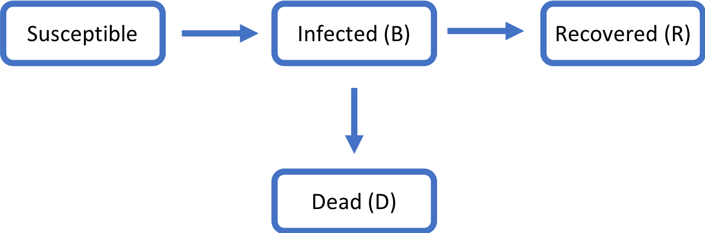
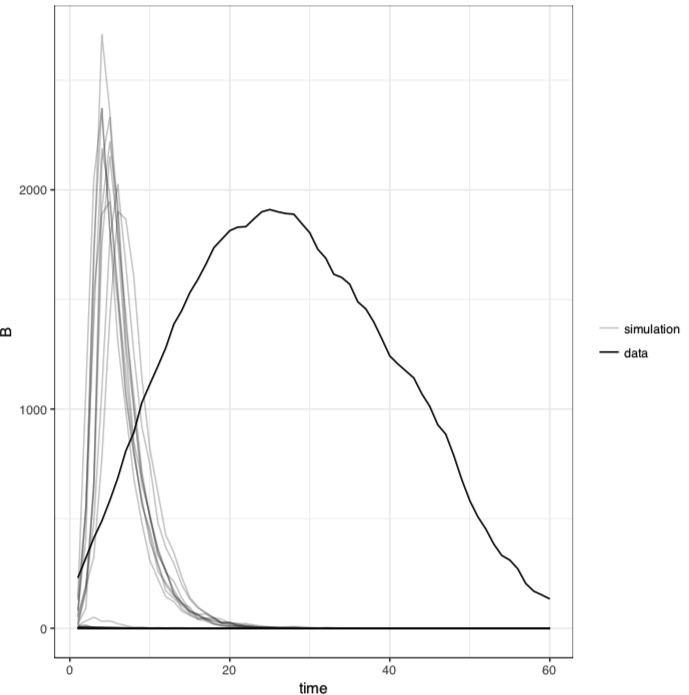
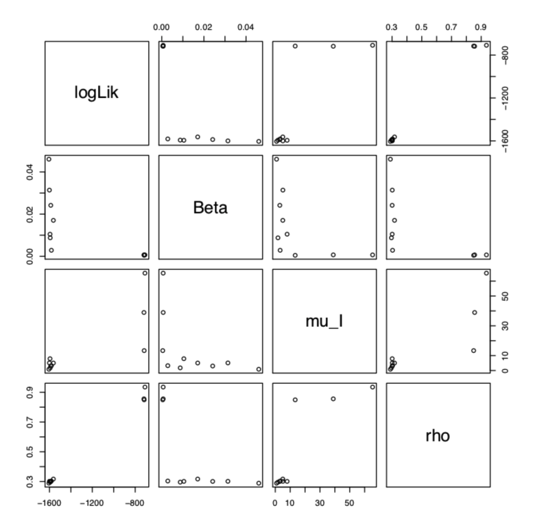
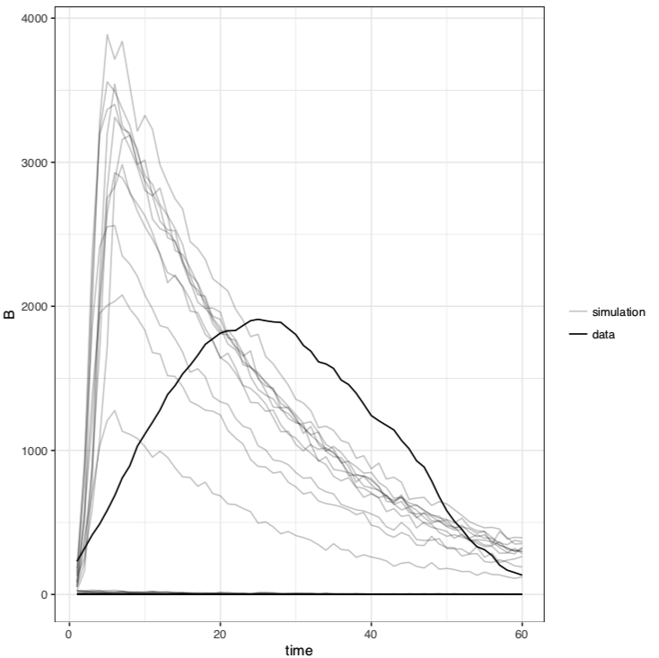
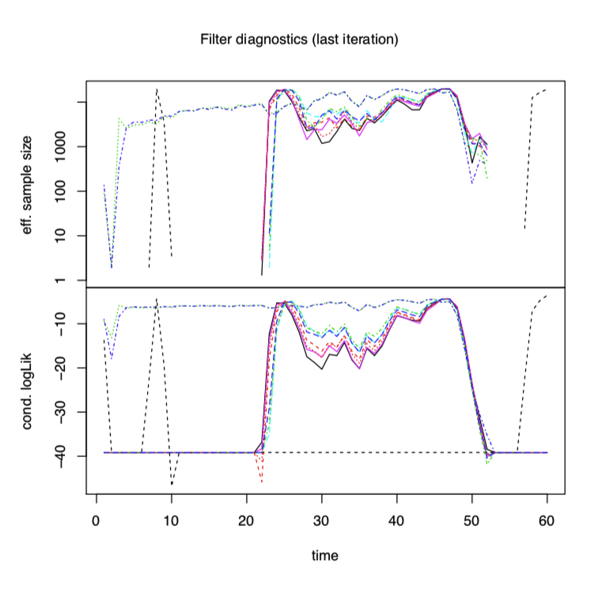
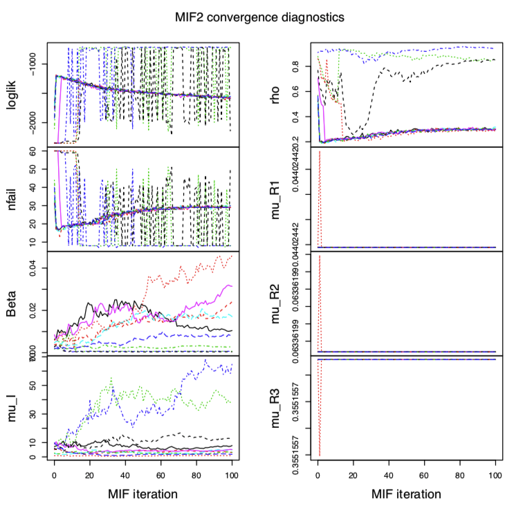

##Modelling of SARS in Beijing April-June, 2003


##1. INTRODUCTION
###1.1 BACKGROUND

Mathematical modelling plays a significant role in understanding the complexities of infectious diseases, which is important for disease control and prediction. Severe acute respiratory syndrome (SARS), as a severe infectious disease, was rapidly spread in more than 28 countries, infected 8098 people and caused 774 deaths worldwide in late 2002 and early 2003. SARS is an acute respiratory illness caused by infection by the SARS virus and the key signs and symptoms are fever, respiratory compromise, chilis, muscle aches and headache. The etiological agent of SARS is a coronavirus, which could be spread predominantly by droplet and by direct or indirect contacts.  Beijing, as the capital city of China with population 17,800,000 was one of the major cities suffer from the disease with 2434 people infected and 147 deaths. Several models were created to study the outbreak of SARS including compartmental models, small world network models, system dynamic models.

###1.2 OBJECTIVES

In this project, we want to build mathematic model to investigate the transmission of SARS in Beijing, China and determined the basic reproductive number for this model. The data will be analyzed with comaprtmental model.

###1.3 DATASET

Chinese government update the SARS data every day online from April 19th to August 16th, 2003. After August 16th, these is no new infection case found in China and it has been reported that the SARS virus was fully eliminated on September 2nd worldwide. The data used in this project was pulled from the everyday report of Ministry of Health of the People’s Republic of China from China Education and Research Network website www.edu.cn . The dataset contains the number of people infected and dead from SARS in Beijing and other parts of China. 

##2. RESULTS AND DISCUSSION

###2.1 Data Exploration

At first, we will look at the data about infection, recovery and death cases from April 19th to August 16th in Beijing. The cases were recorded daily with no missing data.

```{r echo=F, warning=F, message=F}

set.seed(1234567890)
require(ggplot2)
theme_set(theme_bw())
require(plyr)
require(reshape2)
require(magrittr)
require(foreach)
require(doMC)
require(pomp)
require(doParallel)


SARS_data <- read.table("SARS_Beijing.csv", sep=',', header = T)
colnames(SARS_data) <- c('B','C','K','day')

plot(x= SARS_data$day, y=SARS_data$B , xlab='day', ylab='Number of Infection')
plot(x= SARS_data$day, y=SARS_data$C , xlab='day', ylab='Number of Recovered')
plot(x= SARS_data$day, y=SARS_data$K , xlab='day', ylab='Number of Death')

```

From the above plots, there very few new SARS infection cases found in Beijing after 60 days. Most people were recovered from the infection before 60 days too. Data after 60 days are mainly about very few people slowly recovered from the infection in hospital. So, data after 60 days are not considered in this model as it may not be important for the model.

###2.2 Model

```{r, echo=FALSE, out.width = '50%'}

```

Our model has the earmarks of susceptible-infectious-recovered(SIR) model. As the signs of SARS infection is clear and easy to identify, there is no death directly coming from susceptible group.

Model analysis was conducted using the POMP framework. POMP is useful for non-linear processes, which is useful for epidemiological system. POMP gives more flexibility in model creation, which is useful for complex process such as the spread of a disease. The model codes used in this project are heavily borrowed from Note 12 as a similar model structure was used. The model was coded with R and processed under FLUX. The original R code and results and creates from FLUX were included, while R-markdown file was created with directly linking the results and figures created by R-code.

###2.3 Data simulation
At first, several parameters were chosen to compare simulation results with the data. The simulated result is close to data, which will be used in the future.
$$ \beta = 2 $$
$$ \mu_I= 0.04 $$
$$ \rho = 0.3$$
$$ \mu_R1 = 0.05$$
$$mu_R2 = 0.1$$
$$mu_R3 = 0.1$$
The infection vs date plot was shown below:
```{r echo=F, warning=F, message=F}
SARS_b_data <- SARS_data[1:60,]
    SARS_b_statenames <- c("S","I","R1","R2","R3")
    SARS_b_paramnames <- c("Beta","mu_I","rho","mu_R1","mu_R2","mu_R3")
    (SARS_b_obsnames <- colnames(SARS_b_data)[1:3])
    
    SARS_b_dmeasure <- "
    lik = dpois(B,rho*R1+1e-6,give_log);
    "
    
    SARS_b_rmeasure <- "
    B = rpois(rho*R1+1e-6);
    C = rpois(rho*R2);
    K = rpois(rho*R3);
    "
    
    SARS_b_rprocess <- "
    double t1 = rbinom(S,1-exp(-Beta*I*dt));
    double t2 = rbinom(I,1-exp(-dt*mu_I));
    double t3 = rbinom(R1,1-exp(-dt*mu_R1));
    double t4 = rbinom(R2,1-exp(-dt*mu_R2));
    double t5 = rbinom(R3,1-exp(-dt*mu_R3));
    S -= t1;
    I += t1 - t2;
    R1 += t2 - t3;
    R2 += t3 - t4;
    R3 += t3 - t5;
    "
    
    SARS_b_fromEstimationScale <- "
    TBeta = exp(Beta);
    Tmu_I = exp(mu_I);
    Trho = expit(rho);
    "
    
    SARS_b_toEstimationScale <- "
    TBeta = log(Beta);
    Tmu_I = log(mu_I);
    Trho = logit(rho);
    "
    
    SARS_b_initializer <- "
    S=20000;
    I=1;
    R1=0;
    R2=0;
    R3=0;
    "
    
    stopifnot(packageVersion("pomp")>="0.75-1")
    SARS_b2 <- pomp(
      data=SARS_b_data,
      times="day",
      t0=0,
      rprocess=euler.sim(
        step.fun=Csnippet(SARS_b_rprocess),
        delta.t=1/12
      ),
      rmeasure=Csnippet(SARS_b_rmeasure),
      dmeasure=Csnippet(SARS_b_dmeasure),
      fromEstimationScale=Csnippet(SARS_b_fromEstimationScale),
      toEstimationScale=Csnippet(SARS_b_toEstimationScale),
      obsnames = SARS_b_obsnames,
      statenames=SARS_b_statenames,
      paramnames=SARS_b_paramnames,
      initializer=Csnippet(SARS_b_initializer)
    )
     
    sims <- simulate(SARS_b2,params=c(Beta=2, mu_I=0.04, rho =0.3, mu_R1=0.05, mu_R2 =0.1, mu_R3= 0.1, n= 1000000),nsim=10,
                     as.data.frame=TRUE,include.data=TRUE)
    
   
    ggplot(sims,mapping=aes(x=time,y=B,group=sim,color=sim=="data"))+
      geom_line()+guides(color=FALSE)
```

###2.4 Local Search


Our initial step was to perform particle filtering on these maximum likelihood estimates in order to find a suitable set of initial parameters. As we do not have a good filter available due the access of references, a arbitory filter was created based the flue exmaple in the course. As it's not a real data obtained previous studies, the local search using the iterated filtering algorithm specified above does not work well. 

```{r, echo=FALSE, out.width = '50%'}
knitr::include_graphics("3.png")
```

With the maximum loklik parameters, the simulation is not close to the real data. 

```{r, echo=FALSE, out.width = '50%'}

```

###2.5 Global Search

Next a global search using the same iterated filtering algorithm was done. This time, the initial parameters were randomly and uniformly selected from a specified range by mif2 algorithm. 

The parameters range is shown below:

$$ \beta = c(0.001, 0.1) $$
$$ \mu_I= c(0.5, 10) $$
$$ \rho = (0.5, 1)$$


```{r, echo=FALSE, out.width = '50%'}

```
The parameters with maximum liklihood is shown as below:

$$logLik = -708.9$$

$$LogLik se = 0.58$$

$$ \beta = 0.007 $$
$$ \mu_I= 65.3 $$
$$ \rho = 0.935$$
$$\mu_R1 = 0.044$$

$$\mu_R2 = 0.063$$

$$\mu_R3 = 0.355$$


From the simulation with the maximum liklihood parameters from the global search, the result is better than the local search, which means the arbitory parameters are far from the real parameters. The filter parameters should be updated with the global search results. And the parameter range should be changed in future study.

```{r, echo=FALSE, out.width = '50%'}

```

The following are the mif2 maximization procedure plots. From the plots, we can see that $\beta$ and $\mu_I$ fail to converge during the run. It might be becuase the parameter range is not good or the filter is not good. We did see $\rho$ converges to 0.2 which suggest that a low reporting rate. After a few iterations, the mif2 likelihood displays a slow downward trend. This is because mif2 adds extra variability to the model in the form of random perturbations to the parameters. to allow one model to converge to the other.

```{r, echo=FALSE, out.width = '50%'}

```

```{r, echo=FALSE, out.width = '50%'}

```

##3. CONCLUSION AND FUTURE DIRECTION

In this project, we proposed  mathematical model for SARS infection and recovery in Beijing with pomp process. Model parameters were determined from local and global search. But as we do not have previous data as filters, so next step we need to update the filters with our results from global search and rerun the models. Aother future direction is that we might change the model structures. We can add high risk group to the model, as they have close contaction with infected patients. In the goverment reports, these high risk group of people will be separated for about 2 weeks and about 20-30% of these were found to be infected. The new structure model was shown below:

```{r, echo=FALSE, out.width = '50%'}
knitr::include_graphics("2.png")
```

##4. REFERENCE
1. Han, X.-N; De Vlas, S. J.; Fang, L. Q.; Feng, D. Cao, W.-C., Habbema, J. D. F. Mathematical modelling of SARS and other infectious diseases in China: a review TMIH 2009, 13, 92;
2. Zhou, Y.; Ma, Z; A Discrete Epidemic Model for SARS Transmission an Control in China Mathematical and Computer Modelling, 2004, 40 ,1491;
3. CDC Severe Acute Respiratory Syndrone, https://www.cdc.gov/sars/about/faq.pdf
4. Choi, B.C.; Pak, A. W. P.; A simple approximate mathematical model to predict the number of severe acute respiratory syndrome cases and deaths Journal of Epidemiology & Community Health 2003, 57, 831;
5. Fukutome, A.; Watashi, K.; Kawakami, N.; Ishikawa, H. Mathematical Modeling of Severe Acute Respiratory Syndrome Nosocomial Transmission in Japan: The Dynamics of Incident Cases and Prevalent Cases Microbiol. Immunol. 2007, 51, 823;
6. Wang, W.; Ruan, S. Simulating the SARS outbreak in Beijing with limited data J. Theoretical Biol. 2004, 227, 369;
6. Note12 https://ionides.github.io/531w18/12/notes12.html;
7. Final Project 2 in 2006 California Measles - Late 1980s / Early 1990s https://ionides.github.io/531w16/final_project/Project02/stats531_final_project.html

