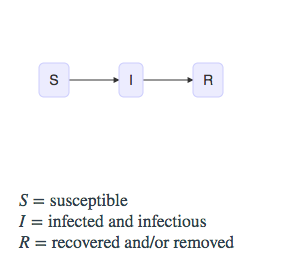
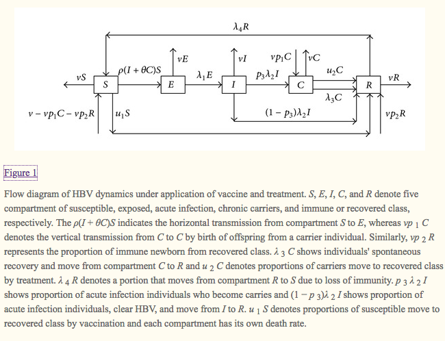
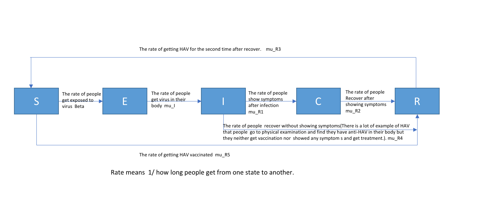
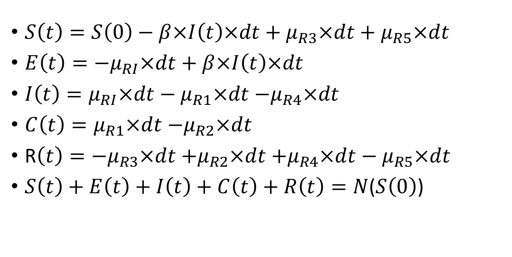

\newcommand\prob{\mathbb{P}}
\newcommand\E{\mathbb{E}}
\newcommand\var{\mathrm{Var}}
\newcommand\cov{\mathrm{Cov}}
\newcommand\loglik{\ell}
\newcommand\R{\mathbb{R}}
\newcommand\data[1]{#1^*}
\newcommand\params{\, ; \,}
\newcommand\transpose{\scriptsize{T}}
\newcommand\eqspace{\quad\quad}
\newcommand\myeq[1]{\eqspace \displaystyle #1}
\newcommand\lik{\mathscr{L}}
\newcommand\loglik{\ell}
\newcommand\profileloglik[1]{\ell^\mathrm{profile}_#1}
\newcommand\ar{\phi}
\newcommand\ma{\psi}
\newcommand\AR{\Phi}
\newcommand\MA{\Psi}
\newcommand\ev{u}
\newcommand\given{{\, | \,}}
\newcommand\equals{{=\,}}
\newcommand\matA{\mathbb{A}}
\newcommand\matB{\mathbb{B}}
\newcommand\matH{\mathbb{H}}
\newcommand\covmatX{\mathbb{U}}
\newcommand\covmatY{\mathbb{V}}

--------------------------

## Introduction

* In this final project, we are going to study the Hepatitis A case in Michigan from 1966 to 1987.

* Hepatitis A is a worldwide public health problem. It is an infectious disease of the liver caused by the hepatitis A virus (HAV). Many cases have few or no symptoms, especially in the young. The time between infection and symptoms, in those who develop them, is between two and six weeks. When symptoms occur, they typically last eight weeks and may include nausea, vomiting, diarrhea, jaundice, fever, and abdominal pain. Around 10–15% of people experience a recurrence of symptoms during the six months after the initial infection. Acute liver failure may rarely occur, with this being more common in the elderly.[1]
Thus, Hepatitis A is a good topic for SIR model we learned from class: people first get the virus by eating food or drinking water contaminated with infected feces, then some of them may get infection, because of the modern treatment, most people will recover from it and never get infection by this virus again.(They get anti-HAV in their body).

* We study the dynamics of hepatitis A virus (HAV) infection which can be controlled by vaccination as well as treatment. We modified the SIR model with SEICR model: E means exposed to HAV virus(infected but not yet infectious individuals (exposed)). C means chronic carriers  Also lots of people get HAV vaccine immunity when they are born or when there is a outbreak aroud them. Besides, some people will get HAV for the second time because of losing the anti-HAV.


-------------------------------

## Data

### Data source

* The data is from https://www.tycho.pitt.edu/ which is an open resource for infectious disease time series data. The original data contains the population who got HAV in every week in every state from 1966 to 1987. I extract the data for michigan and then change them to monthly data with the startcode.py.
```{r}
require(ggplot2)
sample <- read.csv("hep-a-mi.csv",header = TRUE)
head(sample)
```
```{r}
hepa <- read.csv("hep-a-mi2.csv",header = TRUE)
head(hepa)
```

```{r}

hepa <- read.csv("hep-a-mi2.csv",header = TRUE)
hep <- hepa$population
num <- hepa$number
plot(hep~num,type='l',main="Monthly HAV population in Michigan from 1966 to 1987")
library(mFilter)
hp=hpfilter(hep, freq=100,type="lambda",drift=F)
trend=ts(hp$trend)
cycle=ts(hp$cycle)
plot(ts.union(trend,cycle),type="l",xlab="Date",ylab="", main='Decomposition of HAVcases as trend and cycle')
```


* From the plot above, we can see there is a strong trend in the data, the peak may because of an outbreak of HAV which did not get controll around 1970. Then with the progress of modern treatment technology and sanitary condition, less and less people got HAV especially after about 1980.

-------------------------------

## Pomp analysis

### SIR model

* Usually, an infectious disease can be represented by three stages, including susceptible, infectious and recovered. As the introduction in the first part(introduction), SIR is suitable for HAV. So we first build the model same as note 11[2], we have four states S,I,R,H.(The final population result from a process  with probability ρ, which we can think of as the probability that an infection is severe enough to be noticed by the authorities. Since confined cases have, presumably, a much lower transmission rate,  we need a variable H to track this.)

* The model is graphically represented as follows:

```{r}
hav <- read.csv("hep-a-mi2.csv")
hav<- subset(hav,select=c(number,population))
require(pomp)
sir_step <- Csnippet("
  double dN_SI = rbinom(S,1-exp(-Beta*I/N*dt));
  double dN_IR = rbinom(I,1-exp(-gamma*dt));
  S -= dN_SI;
  I += dN_SI - dN_IR;
  R += dN_IR;
  H += dN_IR;
")

sir_init <- Csnippet("
  S = N-1;
  I = 1;
  R = 0;
  H = 0;
")

pomp(hav,,time="number",t0=0,rprocess=euler.sim(sir_step,delta.t=1/4),initializer=sir_init,
     paramnames=c("Beta","gamma","N"),statenames=c("S","I","R","H")) -> sir
pomp(sir,zeronames="H") -> sir
dmeas <- Csnippet("lik = dbinom(population,H,rho,give_log);")
rmeas <- Csnippet("population = rbinom(H,rho);")
sir <- pomp(sir,rmeasure=rmeas,dmeasure=dmeas,statenames="H",paramnames="rho")
sims <- simulate(sir,params=c(Beta=0.25,gamma=0.1,rho=0.9,N=15000),nsim=20,as=TRUE,include=TRUE)
require(ggplot2)
ggplot(sims,mapping=aes(x=time,y=population,group=sim,color=sim=="data"),main='SIR simulation for HAV cases')+
  geom_line()+guides(color=FALSE)
```

* The red lines represent the SIR somulation and the green line represents the pomp data.And from the result we can tell that it fits really well which indicates that SIR is a suitable model for HAV case in Michigan and modifying the SIR is meaningful as next step. 

* The parameters including $\beta$, $\gamma$, $\rho$ and $N$ is set by trying different value and choosing the value used by the best simulation result plots. The value of $\beta$, $\gamma$, $\rho$ is reasonable. $\beta$ represent the rate of the transmission. $\gamma$ means thereciprocal value of the time from when people get the virus to when they show symptoms and get treatment.In this cases its $\delta$$t$ is $1/4$(1 week) and $\gamma$ eauals 0.1 means 10 weeks. It accords with the introduction part.(A little bit large but reasoniable).$N$ represents how many people may get affcted by the virus(who lives near the virus resource.).Since it is very likely to get infection when you have access to the virus, 15000 as start may be too large for this case. $\rho$ means how many people will be report when they recover.90% can be a good explanation.

### SEICR model

#### Model introduction

* SEICR model is a modification of SIR by adding the states of carrier and latency, we have introduced the reason why we used it. This model was firstly published associating with HBV analysis[3]. HBV and HAV is very similar.So I try to fit it in this case by some modify related to the difference between HAV and HBV.

* The model for HBV is graphically represented as follows[3]:


* My modifications(simplifications) are as below:

** Delete birth rate and death rate part. Since HAV seldom results in death and larger model may cause more error resulted from too many parameters, I choose to ignore the death and birth in my case.

** HAV is not a disease with heredity. So the new born babies are less likely to have HAV virus or anti-HAV in their body.

** I combine the parameter of people recovered automatically and after treatment as one parameter recover rate(The effect of these 2 parameter can be studied in the future work)

** Also I change the meaning of some of the states(E: people who ever get access to the HAV source,I: people who really get the virus. C: Showing symptom and carrying the virus) and process to make it more related to HAV.

* So the final model can be show as below:

The equation is as below:


* The other setting is the same as SIR model(The reported data is a binomial process of R(people who recover from infection and who has never show symptom and never get vaccinated but show anti-HAV in their body which is very rare). Also model the rateof  moving from one state to the next over a very short time interval as a binomial random variable)
```{r}
options(
  keep.source=TRUE,
  stringsAsFactors=FALSE,
  encoding="UTF-8"
  )
set.seed(594709947L)
require(ggplot2)
theme_set(theme_bw())
require(plyr)
require(reshape2)
require(magrittr)
require(foreach)
require(pomp)
stopifnot(packageVersion("pomp")>="0.69-1")

```

#### Fitting pomp model
* Now we can build our pomp model. 

```{r}
hep_data <- read.csv("hep-a-mi2.csv")
hep_statenames <- c("S","E","I","C","R")
hep_paramnames <- c("Beta","mu_I","rho","mu_R1","mu_R2","mu_R3","mu_R4","mu_R5")
hep_obsnames <- colnames(hep_data)[2]
hep_dmeasure <- "
  lik = dpois(population,rho*R+1e-6,give_log);
"

hep_rmeasure <- "
  population= rpois(rho*R+1e-6);

"

hep_rprocess <- "
  double t1 = rbinom(S,1-exp(-Beta*I*dt));
  double t2 = rbinom(E,1-exp(-dt*mu_I));
  double t3 = rbinom(I,1-exp(-dt*mu_R1));
  double t4 = rbinom(C,1-exp(-dt*mu_R2));
  double t5 = rbinom(R,1-exp(-dt*mu_R3));
  double t6 = rbinom(I,1-exp(-dt*mu_R4));
  double t7 = rbinom(S,1-exp(-dt*mu_R5));
  S -= t1-t5+t7;
  E += t1 - t2;
  I += t2 - t3-t6;
  C += t3 - t4;
  R += t4 - t5+t6+t7;
"

hep_fromEstimationScale <- "
 TBeta = exp(Beta);
 Tmu_I = exp(mu_I);
 Tmu_R1 = exp(mu_R1);
 Tmu_R2 = exp(mu_R2);
 Tmu_R3 = exp(mu_R3);
 Tmu_R4 = exp(mu_R4);
 Tmu_R5 = exp(mu_R5);
 Trho = expit(rho);
"

hep_toEstimationScale <- "
 TBeta = log(Beta);
 Tmu_I = log(mu_I);
 Tmu_R1 = log(mu_R1);
 Tmu_R2 = log(mu_R2);
 Tmu_R3 = log(mu_R3);
 Tmu_R4 = log(mu_R4);
 Tmu_R5 = log(mu_R5);
 Trho = logit(rho);
"

hep_initializer <- "
 S=5000;
 E=0;
 I=0;
 C=0;
 R=0;
"

require(pomp)
stopifnot(packageVersion("pomp")>="0.75-1")
hep2 <- pomp(
  data=hep_data,
  times="number",
  t0=0,
  rprocess=euler.sim(
    step.fun=Csnippet(hep_rprocess),
    delta.t=1
  ),
  rmeasure=Csnippet(hep_rmeasure),
  dmeasure=Csnippet(hep_dmeasure),
  fromEstimationScale=Csnippet(hep_fromEstimationScale),
  toEstimationScale=Csnippet(hep_toEstimationScale),
  obsnames = hep_obsnames,
  statenames=hep_statenames,
  paramnames=hep_paramnames,
  initializer=Csnippet(hep_initializer)
)
```
```{r}
plot(hep2)
```

* To understand the transmission dynamic of HAV, I tried to estimate those parameters in my model by global search.

* IF2 estimation involves using different starting values for the parameters. We can construct a large box in parameter space containing all plaussible parameter vectors. If the estimation gives a stable performance with different starting values, we could be confidenct that it is an adequate global optimization.


```{r}
run_level <- 3
switch(run_level,
       {bsflu_Np=200; bsflu_Nmif=10; bsflu_Neval=10; bsflu_Nglobal=10; bsflu_Nlocal=10},
       {bsflu_Np=2000; bsflu_Nmif=100; bsflu_Neval=10; bsflu_Nglobal=10; bsflu_Nlocal=10},
       {bsflu_Np=20000; bsflu_Nmif=300; bsflu_Neval=10; bsflu_Nglobal=10; bsflu_Nlocal=10},
       
)


require(doParallel)
cores <- 20  # The number of cores on this machine 
registerDoParallel(cores)
mcopts <- list(set.seed=TRUE)

set.seed(396658101,kind="L'Ecuyer")
bsflu_box <- rbind(
  Beta=c(0.001,0.01),
  mu_I=c(0.5,2),
  mu_R1=c(0.5,2),
  mu_R2=c(0.5,2),
  mu_R3=c(0.5,2),
  mu_R4=c(0.5,2),
  mu_R5=c(0.5,2),
  rho = c(0.5,1)
)

bsflu_rw.sd <- 0.02
bsflu_cooling.fraction.50 <- 0.5
hep_rw.sd <-0.2
stew(file=sprintf("hepeefin_eval-%d.rda",run_level),{
  
  t_global <- system.time({
    mifs_global <- foreach(i=1:bsflu_Nglobal,.packages='pomp', .combine=c, .options.multicore=mcopts) %dopar% 
      mif2(     
      hep2,
      start=c(apply(bsflu_box,1,function(x)runif(1,x[1],x[2]))),
      Np=bsflu_Np,
      Nmif=bsflu_Nmif,
      cooling.type="geometric",
      cooling.fraction.50=bsflu_cooling.fraction.50,
      transform=TRUE,
      rw.sd=rw.sd(
        Beta=bsflu_rw.sd,
        mu_I=bsflu_rw.sd,
        rho=bsflu_rw.sd,
        mu_R1=hep_rw.sd,
        mu_R2=hep_rw.sd,
        mu_R3=hep_rw.sd,
        mu_R4=hep_rw.sd,
        mu_R5=hep_rw.sd
      )
    )
  })
},seed=1270401374,kind="L'Ecuyer")

```


```{r}
plot(mifs_global)
```

* Unfortunately, this more complex and seemingly more realistic model performs even worse than the first model. From the nfail and loglik plot, we can see that the result is going to coverage which means this model fits the data. Also all the parameter seem coverage to  pretty small values. There are some extrems values appeared in the iteration of some parameters(like $mu_R1$)
also this value affected the log likehood


```{r}
stew(file=sprintf("hepeefin-lik_global_eval-%d.rda",run_level),{
  t_global_eval <- system.time({
    liks_global <- foreach(i=1:bsflu_Nglobal,.packages='pomp',.combine=rbind, .options.multicore=mcopts) %dopar% {
      evals <- replicate(bsflu_Neval, logLik(pfilter(bsflu2,params=coef(mifs_global[[i]]),Np=bsflu_Np)))
      logmeanexp(evals, se=TRUE)
    }
  })
},seed=442141592,kind="L'Ecuyer")

results_global <- data.frame(logLik=liks_global[,1],logLik_se=liks_global[,2],t(sapply(mifs_global,coef)))
summary(results_global$logLik,digits=5)

```
```{r}
t_global
```
```{r}
pairs(~logLik+Beta+rho+mu_I+mu_R1+mu_R2+mu_R3+mu_R4+mu_R5,data=subset(results_global,logLik>max(logLik)-50000))
```

```{r}
idx <- which.max(results_global$logLik)
results_global[idx,]
```
### parameter analysis
* Since we have 8 parameters for the SEICR model, we can not guess the parameter as we did in the SIR analysis(although the result is very reasonable). So we use global likehood to search for the best parameter. 

* The maximum likelihood parameters shows out unreasonably low $mu_R1$ and $mu_R2$ and unreasonably large $mu_R4$

* $\beta$$I$ now denotes the rate of how many people will get access to the source of the HAV virus(either the people who got HAV or the food and other staff used by them ) in a time period(one week). The number of $I$ may be about 100~1000 (total number in this case is 5000). If we set it as 500, this rate of exposed to virus is 0.09 which is reasonable.

* $mu_R3$ and $mu_I$ all denote the reciprocal value of the time from 1 state to another(several weeks) which are lso reasonable.

* $\rho$ has the same meening as in the SIR model which also has almost the same value as in SIR.

* All the value of the parameter related to other parameters. Since part of the parameters re too large or small. The other reasonable value may be suspectibal.

# Conclusion

* HAV is a kind of disease whose transmission follows the laws of SIR model. 

* We have found a relatively simple and acceptable model to explain the transmission of HAV. Advantages: simple; reasonable estimate of transmission rate,report rate, recover rate; simulated data fitted really well with the true data. Disadvantage:  the elements which are taking into consideration in SIR model are too limited. The true transmission process needs more elements to measure and simulating.

* We have build a more complicated and realistic model, although by now it has not shown better performance, this does not mean that it’s a worse model than the first simple model. We need more exploration (deleting some process which happens rarely , adjusting global search setting, trying more iterated particle filtering experiment, etc.) to get a better idea about this model


# Future work

* Firstly we can add the birth rate and death rate to the model to make it more realistic.

* Then we can divide the rate from carrier to recover to 2 parts(automatically recover and recover from treatment). Thus, we can set the autumatically recover rate as a fixed parameter, and explore the affact of the HAV treatment techonology. 

* Instead of using R to predict the value of the reported population, we can set I to take the place of R. This is because some people who never show the symptoms may never be reported as the patients of HAV.

* Also the immune rate, the sanitary condition and the treatment methods is being improved as time goes by. We should consider these factors to our models.

* If we keep on working with the model that built in this project, we can change the global searching range for parameters to achieve more realistic value of them. We can set $N$ the total number of population in this case as a changing parameter and immune rate as a fixed parameter(varying in differnt years). If we have more time we can use larger run level to explore the parameter change. I tried runlevel 2 and 3 in this case, the parameter will all converage finally however the maximum likehood changed a lot.

* To explore more about Hepatitis A, we can collect more date in a longer period or larger area. Also we can concentrate on an specific period to analysis the outbreak of Hepatitis A in some areas.

* Since the model is developed based on HBV, changing the meanings of each states still makes it fit poorly to the HAV data. We can do more research and may delete the E state and change the meaning of C as people who carry the virus and do not show the symptom.

# Reference

* [1]https://en.wikipedia.org/wiki/Hepatitis_A

* [2]https://ionides.github.io/531w18/11/notes11.html

* [3]Kamyad AV, Akbari R, Heydari AA, Heydari A. Mathematical Modeling of Transmission Dynamics and Optimal Control of Vaccination and Treatment for Hepatitis B Virus. Computational and Mathematical Methods in Medicine. 2014;2014:475451. doi:10.1155/2014/475451

* The SEIRC part code is modified from the HW9 solution https://ionides.github.io/531w16/hw/sol09.html


