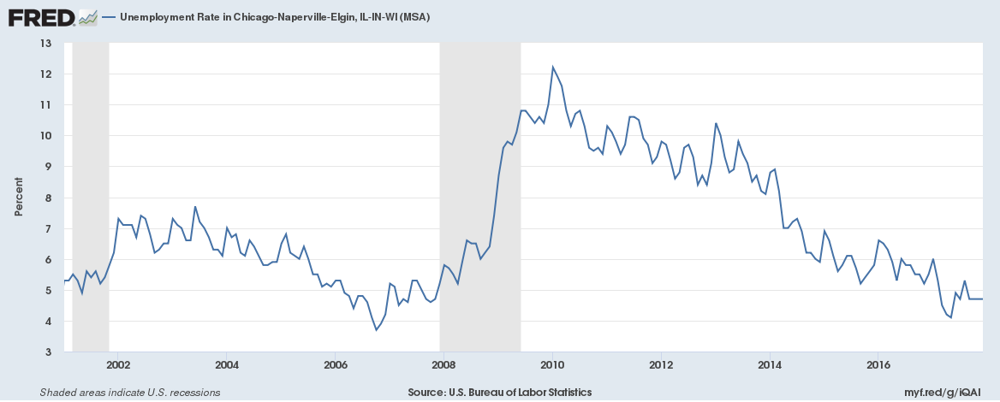
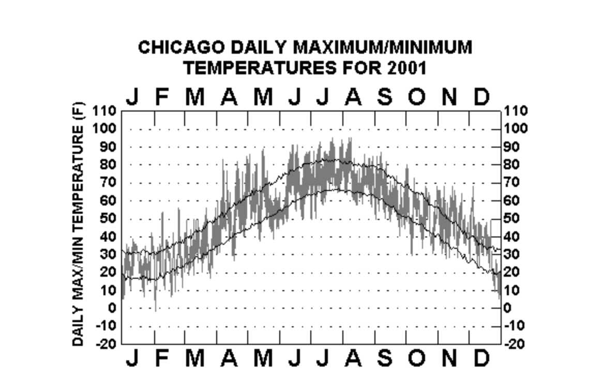
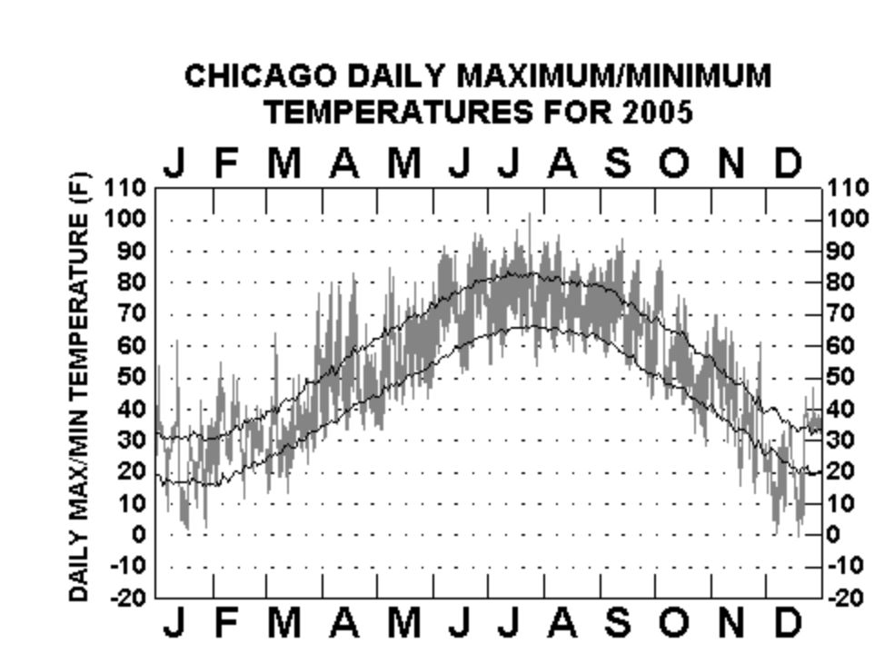
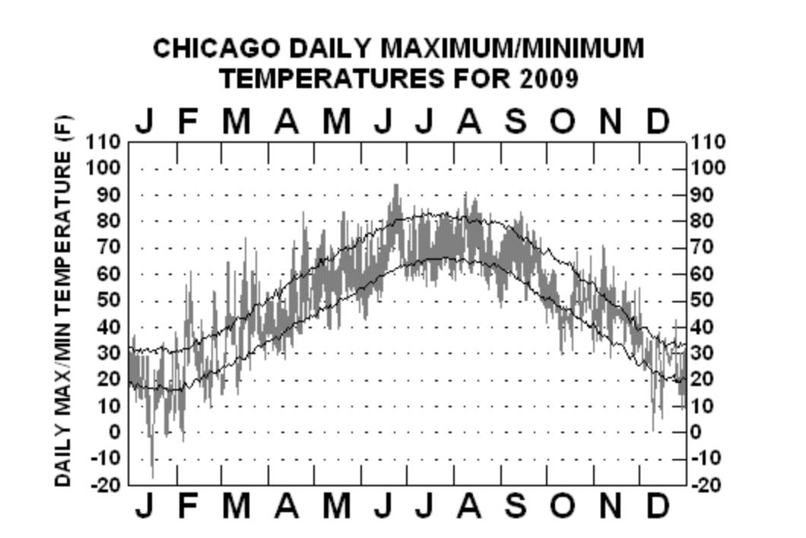
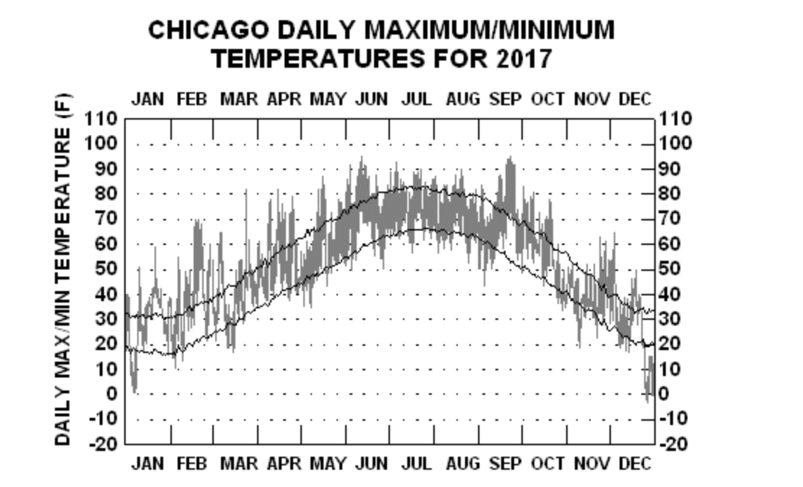

```{R global_options, include=FALSE}
knitr::opts_chunk$set(fig.width = 8, fig.height = 4, fig.path='Figs/', echo=FALSE, warning=FALSE, message=FALSE)
```

```{R}
library(data.table)
library(tidyr)
library(TSA)
library(ggplot2)
library(knitr)
```
    
#1.Introduction
    
As we all know, criminal problem in Chicago is always huge and hard to solve as Rafael Mangual said in his article: "Chicago deserves its reputation as an American murder capital, or at least a significant part of it does." Thus, analyzing the trend of criminal amount in Chicago is meaningful. According to the trend, we can see how was the criminal amount going and analyze the reason. People may also be able to predict the future criminal trend based on the previous trend.

In this project, I use data that reported incidents of crime that occurred in the City of Chicago from 2001 to present(minus the most recent seven days) trying to sumulate the trend of the crime amount in Chicago. And also explore interesting properties of the data along the way.
    
#2.Data Exploration
    
The raw data can be downloaded from https://catalog.data.gov/dataset/crimes-2001-to-present-398a4. The origin data records the details of every incidents of crime occured such as case number, date when the incident occurred, criminal type, location and so on. Every incidents has an identified ID. Upon the date I downloaded this data, there are total 6546196 incidents of crime occured from 2001-01 to 2018-02.  

In this project, I only focus on the monthly amount of criminal incidents. Thus, I preprocess the data by counting the indicents occured each month. We can take a briefly look at the data after recoding. N represents the amount of incidents and the corrsponding time is the month those incidents occured.

```{R, include = FALSE}
dt = fread("Crimes_-_2001_to_present.csv")
dt0= dt[,c(1,3)]
dt0$Date = substr(dt0$Date, 1,10)
date = separate(dt0,Date, into = c("month", "date","year"), sep = "/", extra = "drop")
data = date[,-3][,.(n=.N), by = .(year, month)][order(year, month)][,.(n, time = paste(year, month, sep="-"))]
head(data)
```

Also check the summary of the data. 

```{R}
summary(data$n)
cat(paste("\n", "Range of Time: ", range(data$time)[1], ",", range(data$time)[2]))
```

Then I make a time plot for the data. 

```{R}
plot(data$n, xlab = "Time", type="l", ylab = "monthly criminal incidents amount", main = "Time plot of criminal incidents amount")
```

We can see an strong seasonal pattern for approx. every 12.5 months (50/4 = 12.5) as well as a decreasing trend. The variance seems stable here except little variation. 

Then take a look of unsmoothed spectrum.

```{R}
spectrum(data$n, main="Unsmoothed periodogram")
```

After smoothing, the spectrum is showed as following. 

```{R}
result = spectrum(data$n,spans=c(10,10), main = "Smoothed periodogram for origin data")
```

We can see there is a dominant freqency. After calculating, we get the dominant freqence is 0.0833. And the period is 12 month (1/0.0833), which is corresponding to the result derived from the time plot.

```{R}
domf = result$freq[which.max(result$spec)]
cat(paste("The dominant frequence for origin data is", domf, "\n"))
t = 1/domf
cat(paste("The dominant period for origin data is", t, "month."))
```
   
#3.Detrending the Data 
    
**<big>Variance</big>**
    
Although the variance showed in the time plot looks stable, I still take a look at the log data to see if there is any improvement of the stablility of variance.  

Therefore, I plot the first degree differencing on original data and log data. The graph are shown below.

```{R}
plot(diff(data$n), type = "l", main = "Differencing on original data")
```

```{R}
plot(diff(log(data$n)), type = "l", main = "Differencing on log data")
```

The fluctuate pattern showed in two graph is similar and both have an relative stable variance over time. Then take a look at the smoothed spectrum. 

```{R}
par(mfrow=c(1,2))
spectrum(data$n, spans=c(10,10), main = "Smoothed periodogram for origin data")
result0 = spectrum(log(data$n), spans=c(10, 10), main = "Smoothed periodogram for log data")
```

From the graph, we can see that the spectrum pattern of the origin data and log data are almost identical. Thus, combining the differencing graph, we can conclude that the log transformation doesn't improve a lot and we will stick on the origin data.
    
**<big>Trend</big>**
    
As showing in the time plot, the origin data has a decreasing trend. To tackle with this trend, I apply the linear regression with ARMA errors technique.  
For this dataset, we can see from the time plot, the decreasing trend is obvious from 2001 to 2016 while after 2016, the trend of the data becomes flat. Thus, I applied the model: $$X = \beta_1 * \mathrm{Month Index} + \beta_2 * \mathrm{Month Index}^2 + \beta_3 * \mathrm{Month Index}^3 + \eta_n $$
Here, $X$ is the monthly amount of the criminal incidents and $\mathrm{Month Index}$ is calculated by transforming the year-month date to month, i.e. transform 2001-01 to 1 and 2018-02 to 206. $\eta_n$ is a correlated ARMA error which will be analyzed later. 
The following is the summary of the linear model.

```{R}
month = seq(1,206)

lm1 = lm(data$n ~ month + I(month^2) + I(month^3))
summary(lm1)
```

We see that all the polynomial coefficients are being evaluated as significant. Also plot the data and the models.

```{R}
plot(data$n, xlab = "Time", type="l", ylab = "crime number per month", main = "Crime number regressed on time")
lines(lm1$fitted.values, col = 'red', lty = 1)
```

The model is ploted in red. By the plot, we can see that the model fits the trend of the data pretty well. Therefore, I will use this ploynoimial. 

#4.Seasonality Examination

Apart from the ploynoimial term in the linear regression with ARMA errors, we still need to determine the ARMA error term. 
First plot the ACF(here I use correlation plot) of the residuals of the linear model. 

```{R}
acf(lm1$residuals, main = "ACF of residuals")
```

From the ACF plot, we can see a significant periodic existing in the residual of the linear model. I will add AR(2) to the model to fit the seasonal trend of the residual. 
Then, plot the smoothed spectrum of residuals. 

```{R}
rsd = spectrum(lm1$residuals,spans=c(10, 10), main = "Smoothed periodogram for residuals")
```

```{R}
domf = rsd$freq[which.max(rsd$spec)]
cat(paste("The dominant frequence for residuals is", domf, "\n"))
t = 1/domf
cat(paste("The dominant period for residuals is", t, "month."))
```

Based on the result of period showed above, residuals also follow the 12 month period as the origin data. Thus, it is proper to model the residual by monthly SARIMA model(period = 12). 

#5.Model Fitting

**<big>Model for residuals</big>**

Next step is to fit a SARIMA model to the residuals of the linear model. As the analysis result above, the fitted model will be a model whose period equals to 12 and goed with AR(2) for the annual polynomial. 
To determine the model for monthly part, we calculate the AIC.

```{R}
aic_table <- function(data, P, Q){
  table <- matrix(NA,(P+1),(Q+1))
  for(p in 0:P) {
    for(q in 0:Q) {
       table[p+1,q+1] <- arima(data,order=c(p,0,q), 
                  seasonal = list(order = c(2,0,0), 
                                  period = 12), method = "ML")$aic
    }
  }
  dimnames(table) <- list(paste("<b> AR",0:P, "</b>", sep=""),paste("MA",0:Q,sep=""))
  table
} 
tab <- aic_table(lm1$residuals,1,4)

kable(tab, digits = 3, 
      caption = "AIC Values of ARIMA models for Model Errors with AR(2) Seasonal Component, period=12")
# AR1 MA0
```

Among the table, SARIMA(1,0,1)x(2,0,0) with period equals to 12 has the lowest AIC and it’s a simple model. We will stick with this model for residuals.

Fit SARIMA(1,0,1)x(2,0,0) with period = 12 model to the residuals. The summary is showed below.

```{R}
model = arima(lm1$residuals,order=c(1,0,1), 
                seasonal = list(order = c(2,0,0), 
                period = 12))
print(model)
```

Then look at the diagnostic for this fitting model on residuals. The error of this SARIMA model assumed to be a white noise. 
First check the ACF(here I use correlation plot) of the SARIMA model error. 

```{R}
acf(resid(model), main = "ACF of SARIMA errors", lag = 206)
```

In plot, we see there are still 5 violations (out of 206 lags) of our hypothesis testing lines of IID errors in our model but the seasonallity is disappear. The 5 violations seems random, so here I didn't take them into consideration. The errors are approx. uncorrelated. 

Then plot the smoothed spectrum of the error. 

```{R}
spectrum(model$residuals, span = c(10,10), main = "Smoothed periodogram for SARIMA error")
```

From the plot, we see dominant freqence is eliminated. There is no dominant cycles, which is also evidence of non-seasonal errors. 

Then test the noemality of errors by drawing qq plot.

```{R}
qqnorm(model$residuals)
qqline(model$residuals)
```

We see the result of qq plot is pretty well, indicating that the error follows normal distribution.

Last, check the mean and variance. Plot the errors itself.

```{R}
plot(model$residuals, main = "SARIMA error plot", ylab = "SARIMA error")
```

It's can be concluded that the mean of errors is approx. 0. And the variance is stable. 
In conclude, we can say that the error of SARIMA model is approx. white noise error，which is tally with the assumption of SARIMA model. It is appropriate to fit the SARIMA(1,0,1)x(2,0,0) with period=12 model to the residual of the linear model.

**<big>Final Model</big>**

Based on the above analysis, the reasonable model for the monthly criminal incidents amount is a linear model with SARIMA errors. The model is: $$X = \beta_1 * \mathrm{Month Index} + \beta_2 * \mathrm{Month Index}^2 + \beta_3 * \mathrm{Month Index}^3 + \eta_n$$
where $\eta_n$ is a SARIMA error, fitted by SARIMA(1,0,1)x(2,0,0) with period=12 model.

Then, fit this final model to the origin data. The summary is showed below.

```{R}
sq_month = month^2
cb_month = month^3
final_model = arima(data$n, order=c(1,0,1), 
                seasonal = list(order = c(2,0,0), 
                period = 12), xreg = cbind(month, sq_month, cb_month), 
                method = "ML")
final_model
```

In the end, fit the origin data with this model. The fitted result is below. The red line is the origin data while the blue line is the fitted value.

```{R}
plot(data$n, col="red", type="l", xlab = "Time", ylab = "Crime number", main = "Model fit result")
lines(fitted(final_model),col="blue")
```

The fitted result is actually very well. The fitted curve almost grasp all the seasonality of the origin data and also simulate the trend precisely.

#6.Conclusion
    
1. The amount of the criminal incidents in Chicago has a seasonality of 1 cycle per year. Within the cycle, the shape of the amount of crimes is like a open down parabola. The crime number first increases, reaching the peak around middle of the year and then drop down.

2. The data also has a quick descreasing trend from 2001 to 2016 while after 2016, the trend becomes flat, which means the amount of the criminal incidents after 2016 stop decreasing in Chicago.
      
3. According to the fitted result, specifically, the fit model is: $$(1 - 0.7416\mathrm{B})(1 - 0.5502B^{12} - 0.3677B^{24})(Y_n + 34.3648n - 1.5187n^{2} +  0.0043n^{3} + 40375.03) = (1 - 0.3197B )\epsilon_n)$$
where $\epsilon_n$ is a white noise. n is the month index I defined before. And the $Y_n$ is the monthly amount of the criminal incidents.

#7.Future analysis

We noticed evidence of 1 year cycle of the amount of the criminal incidents. I think it is worth investigating the reason of the open down parabola pattern. 

**<big>Unemployment Rate and Crime</big>**

A brief look into the relationship between crime numbers and unemployment rate is reasonable. It is make sense that the change of the unemployment rate will influence the crime numbers. The unemployment will make people's living hard so that they may  commit crime to make a living.

The unemployment rate data shown below is retrieved from https://fred.stlouisfed.org/series/CHIC917URN.

<center>
<div style="width:900px; height=500px">

</div>
</center>

We can see that the pattern and trend of Unemploymen rate and the crime numbers are very different. Without further explore, it hard to conclude that the Unemploymen rate and the crime numbers are correlated in Chicago.

**<big>Climate and Crime</big>**

Exploring the relationship between climate and unemployment rate is also reasonable. Since winter of Chicago is harsh, it seems like natural that the crime number will decrease when the temperature becomes lower. When the winter comes, the temperature will be low and always snow a lot. Therefore, people tends to stay in one place rather than linger around outside. 

The climate data shown below is retrieved from https://www.climatestations.com/chicago/. We will take a look at the climate data of 4 years: 2001, 2005, 2009, 2017 for generallity.

<center>
<div style="width:900px; height=500px">

</div>
</center>

<center>
<div style="width:900px; height=500px">

</div>
</center>

<center>
<div style="width:900px; height=500px">

</div>
</center>

<center>
<div style="width:900px; height=500px">

</div>
</center>

We can see that the pattern of the Chicago climate within one year is similar to the crime numbers. Both of them are open down parabola and reach the peak around the middle of year (Jun, Jul Aug). Here, since without further analysis, it is just possible that the climate is related with the crime activities. When the temperature is high, the crime activities will be more active. In the future, this will be worth to explore more.


#8.References
Ionides, E. (n.d.). Stats 531 (2018, winter). ‘Analysis of Time Series’. Retrieved from http://ionides.github.io/531w18/ 

Rafael Mangual (2017, summer). Sub-Chicago and America’s Real Crime Rate. Retrieved from    

https://www.city-journal.org/html/sub-chicago-and-americas-real-crime-rate-15341.html.     

Chicago Data Portal (2018, March). Crimes - 2001 to present.  Retrieved from https://data.cityofchicago.org/Public-Safety/Crimes-2001-to-present/ijzp-q8t2     
 
FRED Economic Data. Unemployment Rate in Chicago-Naperville-Elgin, IL-IN-WI (MSA). Retrieved from https://fred.stlouisfed.org/series/CHIC917URN    

ClimateStations. Graphical Climatology of Chicago (1871-Present). Retrieved from https://www.climatestations.com/chicago/


